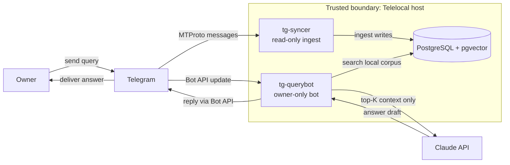
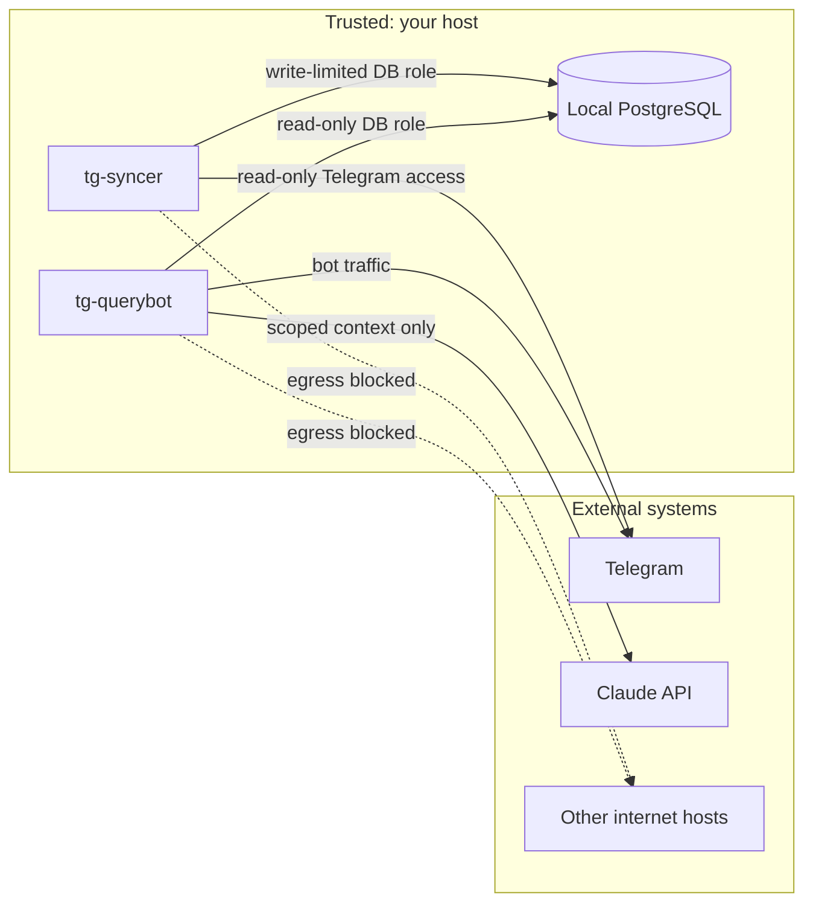
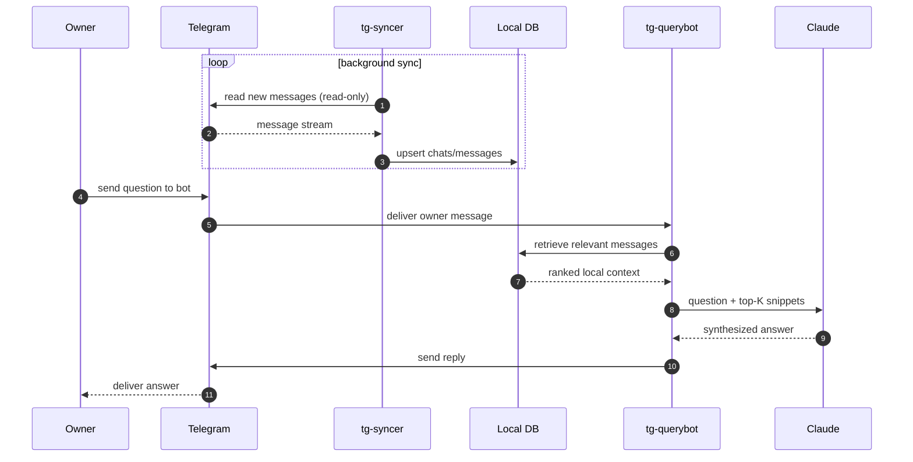
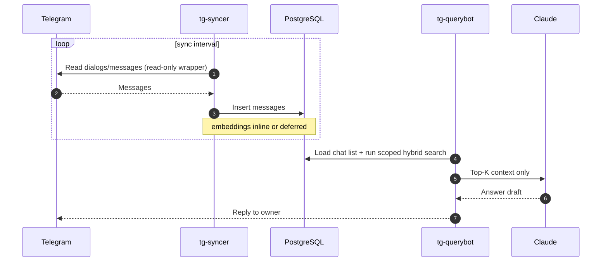

# Telelocal

Telelocal is a local-first, security-hardened Telegram assistant. 

It ingests messages from your Telegram account (within configured scope) into a local PostgreSQL database, then answers questions from that local index through a private Telegram bot interface.

---

## Table of Contents

- [What This Project Is For](#what-this-project-is-for)
- [Architecture At A Glance](#architecture-at-a-glance)
- [Design Priorities](#design-priorities)
- [Why Not Bot-Per-Chat Workflows](#why-not-bot-per-chat-workflows)
- [Security Design](#security-design)
- [Ingestion And Query Pipeline](#ingestion-and-query-pipeline)
- [Quick Start](#quick-start)
- [Operational UX](#operational-ux)
- [Performance Tuning For Large Accounts](#performance-tuning-for-large-accounts)
- [Repository Layout](#repository-layout)
- [Threat Model And Known Limits](#threat-model-and-known-limits)
- [Incident Response Quick Actions](#incident-response-quick-actions)
- [Documentation Map](#documentation-map)
- [License](#license)

---

## What This Project Is For

**Telelocal exists for a specific workflow:**

- You have many Telegram chats (especially groups) with different contexts.
- Important asks and decisions get buried quickly.
- You need fast cross-chat retrieval and summaries.
- You want to keep your searchable corpus local, with strict security boundaries.

**Typical questions:**

> "What needs my attention from the past 24 hours?"
> "Can you summarize all my recent chats for the past 3 days?"
> "What did team X decide about pricing this week?"
> "Show where I was mentioned and whether a response is needed."

**Core intent:**

- Local-first data ownership
- Security-first isolation and credential handling
- Practical coverage for large chat sets

---

## Architecture At A Glance

Telelocal runs two core services inside one host boundary:

1. `tg-syncer` ingests Telegram history (read-only) into a local DB.
2. `tg-querybot` answers owner questions from that local DB and sends replies back in Telegram.

### 1) System Overview



### 2) Trust Boundaries



- Trust anchor: the local host and database.
- Data leaves the host only on the query path, and only as scoped/top-K context.
- `nftables` and systemd hardening enforce per-service network/process limits.

### 3) Simple User Flow



For deeper component and threat detail:

- [Architecture reference](tg-assistant/docs/ARCHITECTURE.md)

---

## Security Design

Security in Telelocal is layered, not single-control:

| Layer | Control | Goal |
|---|---|---|
| Application | `ReadOnlyTelegramClient` allowlist (default deny) | Prevent Telegram write actions in syncer |
| Identity | Dedicated users: `tg-syncer`, `tg-querybot` | Reduce lateral movement |
| Database | `syncer_role` write-limited, `querybot_role` read-only on messages | Minimize blast radius |
| Network | nftables per service/UID egress policy | Block arbitrary exfiltration |
| Credentials | `LoadCredentialEncrypted` / `systemd-creds` | No plaintext secrets on disk |
| Auditing | Structured audit log | Forensics + anomaly review |

### Key implementation details

- `ReadOnlyTelegramClient` is an allowlist with default deny (`get_messages`, `iter_messages`, `get_dialogs`, `iter_dialogs`, `get_entity`, `get_participants`, `get_me`, `download_profile_photo`, `connect`, `disconnect`, `is_connected`).
- `tg-querybot` is owner-only at filter registration and handler level.
- Systemd units use hardening controls such as `NoNewPrivileges=true`, `ProtectSystem=strict`, `ProtectHome=true`, `PrivateTmp=true`, dropped capabilities, and restricted address families.
- Credentials are injected via `LoadCredentialEncrypted=` and decrypted only for service runtime.
- Querybot egress is DNS-refreshed IP-set based (`api.telegram.org`, `api.anthropic.com`), and syncer egress is limited to Telegram MTProto ranges.
- DB role split enforces least privilege (`syncer_role` write-limited for ingestion path; `querybot_role` read-only on message corpus).

---

## Ingestion And Query Pipeline



**Ingestion behavior (current design):**

- Freshest-first dialog ordering
- Activity window filter via `syncer.max_history_days`
- Pass cap via `syncer.max_active_chats`
- Chat-type scope via `syncer.include_chat_types`
- Optional deferred embeddings (`syncer.defer_embeddings = true`)

**Ingestion security properties:**

- Messages are pulled via a read-only wrapper path (default deny on unknown Telethon methods).
- Sync runs under dedicated user + service sandbox.
- Sync egress is constrained to Telegram ranges at kernel level.
- Stored corpus is immediately subject to DB role separation.

**Query behavior (current design):**

- Intent extraction narrows scope (chats, terms, time range)
- Hybrid retrieval (FTS + vector) with lexical gate for short queries
- Fallback path when scoped retrieval is empty

**Query security properties:**

- Non-owner requests are silently ignored.
- Retrieval is scoped before synthesis to reduce cloud payload.
- Querybot role is read-only for messages.
- Querybot egress is restricted to Telegram Bot API + Anthropic API address sets.

---

## Quick Start

```bash
git clone <your-repo-url> telelocal
cd telelocal/tg-assistant
sudo ./scripts/setup.sh
```

Then:

```bash
telelocal status
telelocal sync-status
telelocal logs
```

Recommended immediately after first deploy:

```bash
sudo ./tests/security-verification.sh
```

For full deployment details and troubleshooting:

- [Quick Start guide](tg-assistant/docs/QUICKSTART.md)

---

## Operational UX

Day-to-day commands are intentionally small:

| Need | Command |
|---|---|
| Service health | `telelocal status` |
| Ingestion progress | `telelocal sync-status` |
| Runtime logs | `telelocal logs` |
| Adjust scope/exclusions | `sudo telelocal manage-chats` |
| Restart services | `sudo telelocal restart` |
| Deploy checked-out changes safely | `sudo telelocal update <path-to-clone>` |
| Prune old history | `sudo telelocal prune` |

Operator-focused bot prompts:

- `/mentions 1d quick`
- `/summary 1d quick`
- `/summary 1w detailed`
- `/fresh 25 quick`
- `/more`

---

## Repository Layout

```text
tg-assistant/
  config/      # settings + system prompt
  docs/        # quickstart, architecture, threat/security model, hardening notes
  nftables/    # egress policy template
  scripts/     # setup, update, ops helpers
  src/
    syncer/    # ingestion pipeline
    querybot/  # query + response pipeline
    shared/    # db/secrets/audit/safety shared utilities
  systemd/     # service and timer units
  tests/       # unit/integration/security checks
```

---

## Threat Model And Known Limits

### High-value assets and actors

**Highest-value assets:**

- Telethon session + session encryption key (account-level impact if misused)
- bot token and Claude API key
- local message corpus and audit logs

**Key threats:**

| Threat | Severity | Primary controls |
|---|---|---|
| Telethon session theft/use | Critical | encrypted session at rest, credential isolation, host hardening |
| Unintended Telegram writes | Critical | read-only Telethon wrapper allowlist (default deny) |
| Exfiltration from compromised service | High | per-service nftables egress restrictions |
| Unauthorized bot access | High | owner-only filter + handler guard |
| Prompt injection in synced content | Medium | untrusted-context prompt design, scoped retrieval, no direct write path |

---

## Incident Response Quick Actions

If compromise is suspected:

1. Stop services: `sudo systemctl stop tg-syncer tg-querybot`
2. Preserve logs: copy `/var/log/tg-assistant/audit.log` and relevant `journalctl` output
3. Rotate/revoke: Telethon session, API ID/hash, bot token, Claude API key, session encryption key
4. Re-run checks: `sudo ./tests/security-verification.sh`
5. Recreate session and restart only after review

---

## Documentation Map

- Deployment + troubleshooting: [tg-assistant/docs/QUICKSTART.md](tg-assistant/docs/QUICKSTART.md)
- Architecture reference: [tg-assistant/docs/ARCHITECTURE.md](tg-assistant/docs/ARCHITECTURE.md)
- Threat model snapshot: [tg-assistant/docs/THREAT_MODEL.md](tg-assistant/docs/THREAT_MODEL.md)
- Telethon hardening details: [tg-assistant/docs/TELETHON_HARDENING.md](tg-assistant/docs/TELETHON_HARDENING.md)
- Full security model and attack trees: [tg-assistant/docs/SECURITY_MODEL.md](tg-assistant/docs/SECURITY_MODEL.md)

---

## License

MIT License.

Dependencies:

- Telethon: MIT
- python-telegram-bot: LGPL-3.0
- Claude API usage: Anthropic Terms
