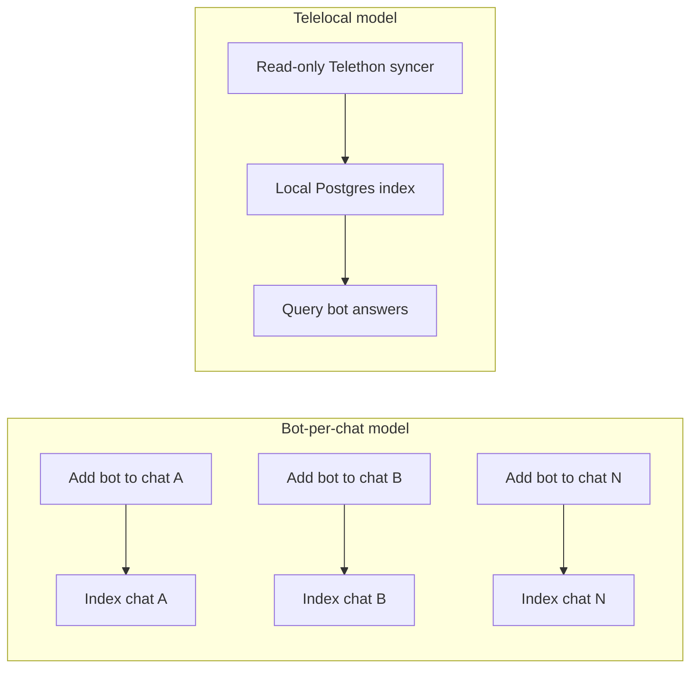
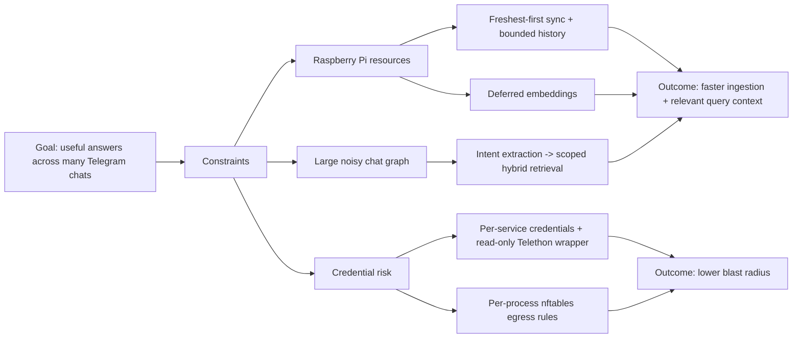
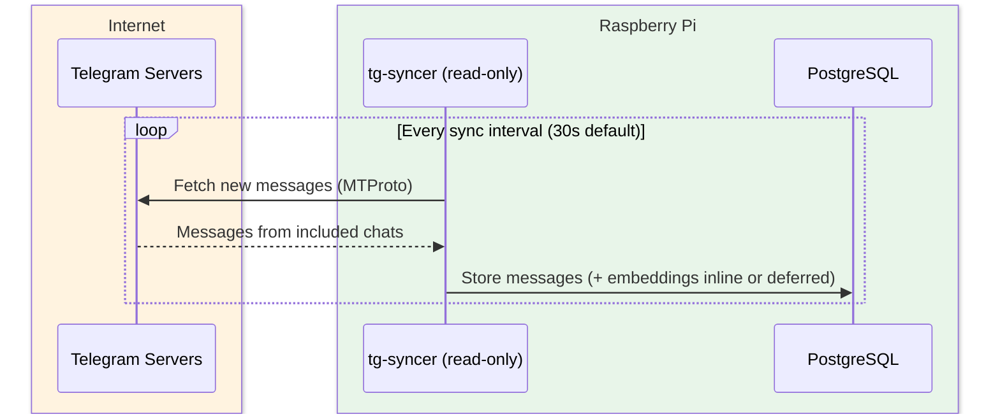
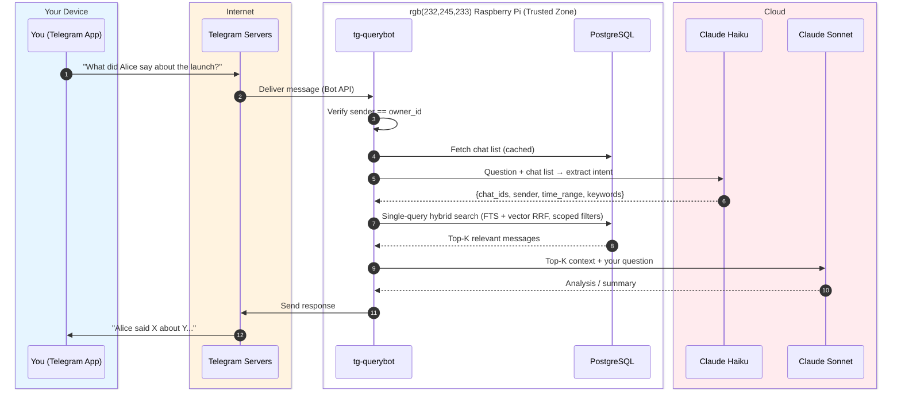
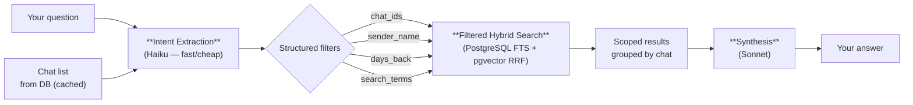
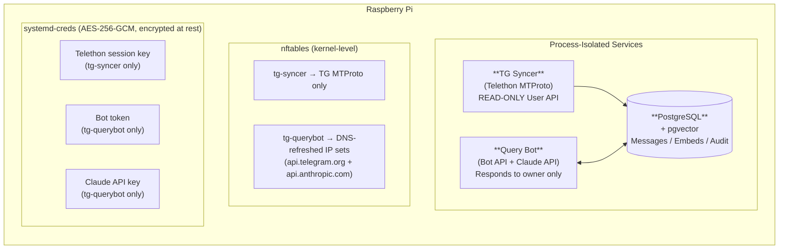
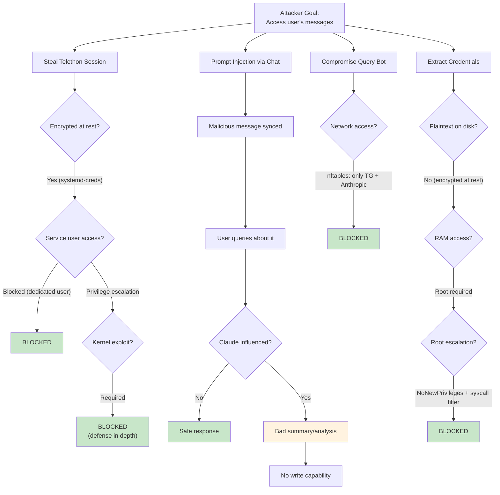

# Telelocal

Telelocal is a defense-in-depth, local-first Telegram assistant that syncs your Telegram messages (within your configured sync scope) to a local database and lets you query them through a private bot. Deployed on a Raspberry Pi for physical control over your data. The ingestion of your messages via a telethon session also offers a more practical approach than adding a bot to all your chats and feeding an agent your credentials as is the case in implementations like OpenClaw. This is currently a POC so please feel free to add any suggestions!

## Why This Exists

Managing many Telegram groups, channels, and conversations means important messages get buried. This system gives you a single interface to search and analyze your entire Telegram history:

> "What did Alice say yesterday about the product launch?"
> "Summarize the discussion in the engineering group this week"
> "Find all messages mentioning the budget deadline"

Core design intent:
- **Local-first**: ingest once into your own local datastore, then query locally.
- **Security-first**: minimize secret exposure and enforce strict process/network boundaries.
- **Convenience at scale**: avoid per-chat bot administration when you have many chats.

### Why This Instead Of Bot-Per-Chat Workflows

Some Bot API-first tools (including OpenClaw-style setups) often require adding a bot to each chat you want indexed. That can be impractical for operators with hundreds of client/group conversations and creates operational drift (new chats not covered until manually added).

Telelocal uses a read-only Telethon syncer under your own account session to ingest from your configured scope, then serves queries from local Postgres.



Net effect:
- fewer manual steps to maintain coverage,
- better freshness consistency across many chats,
- tighter security controls around a single local ingestion pipeline.

---

## Table of Contents

- [Start Here](#start-here)
- [Design Considerations](#design-considerations)
- [How It Works](#how-it-works)
- [Architecture Overview](#architecture-overview)
- [Security Model](#security-model)
- [Telethon vs Bot API](#telethon-vs-bot-api)
- [Threat Analysis](#threat-analysis)
- [Pi vs VPS](#pi-vs-vps)
- [Implementation Details](#implementation-details) (includes [Codebase Size](#codebase-size))
- [Deployment Guide](#deployment-guide)
- [Verification Procedures](#verification-procedures)
- [Incident Response](#incident-response)
- [Known Security Limitations](#known-security-limitations)

---

## Start Here

If you are deploying now, do this path first:

```bash
git clone <your-repo> telelocal
cd telelocal/tg-assistant
sudo ./scripts/setup.sh
```

After setup:

```bash
telelocal status
telelocal sync-status
telelocal logs
```

Primary bot commands:
- `/summary 1d quick` — daily cross-chat recap
- `/mentions 1d quick` — likely action items for you
- `/fresh 25 quick` — snapshot of freshest chats
- `/more` — continue long output

First-run expectations:
- Initial sync is incremental and may take 10-30+ minutes on large accounts.
- The bot is usable immediately, but answer quality improves as sync coverage grows.
- If message counts stay flat for 15+ minutes, run `telelocal logs` and follow `tg-assistant/docs/QUICKSTART.md` troubleshooting.

Use this doc by intent:
- Deploy + day-2 operations: `tg-assistant/docs/QUICKSTART.md`
- Threat model + risk decisions: `tg-assistant/docs/SECURITY_MODEL.md`
- Telethon hardening details: `tg-assistant/docs/TELETHON_HARDENING.md`

For full deployment/runbook instructions, use `tg-assistant/docs/QUICKSTART.md`.

---

## Design Considerations

Telelocal is intentionally optimized around four constraints:

1. **Local-first data control** — ingest once into local Postgres, query locally, and avoid depending on Telegram bot membership per chat.
2. **Security-first boundaries** — separate sync/query processes, separate DB roles, strict egress controls, and secret isolation per service.
3. **Fast-enough on constrained hardware** — prioritize freshest chats, bounded history windows, deferred embeddings, and single-query hybrid search.
4. **Simple operator UX** — one setup flow, one CLI (`telelocal`), and predictable day-2 commands.

### Decision Map



### Data Exposure Minimization


Design implication:
- Claude never needs full database access.
- Most filtering happens locally first.
- The searchable corpus can be large while per-query cloud payload stays small.

### Practical Tuning Order

If ingestion/query speed is the priority, tune in this order:

1. `syncer.max_active_chats`
2. `syncer.max_history_days`
3. `syncer.include_chat_types`
4. `syncer.defer_embeddings`
5. `querybot.max_intent_chats`

If security hardening is the priority, validate in this order:

1. Credential isolation (`LoadCredentialEncrypted`, file perms, service ownership)
2. Network policy (nftables sets and service egress)
3. Read-only Telethon enforcement (`ReadOnlyTelegramClient`)
4. DB role separation (`syncer_role` write scope, `querybot_role` read-only)

---

## How It Works

Two independent processes run on your Raspberry Pi:

1. **Background sync** — `tg-syncer` continuously pulls messages from your configured chat scope and stores them locally. You never interact with it.
2. **On-demand query** — When you message the bot, `tg-querybot` searches the local database, sends the relevant messages to Claude, and returns the answer.

### Background: Message Sync



The syncer uses a **read-only wrapper** around Telethon — only 11 explicitly allowed read methods work. All write methods (`send_message`, `delete_messages`, etc.) raise `PermissionError`.

The syncer paginates message history to avoid gaps: on the first sync of a chat it walks back through history (bounded by `max_history_days` if set), and on subsequent syncs it fetches **all** messages newer than the last stored ID — even if more than one batch arrives between cycles.

For group/thread context quality, synced rows also store reply linkage (`reply_to_msg_id`) and thread-top linkage (`thread_top_msg_id`) so downstream summarization can reconstruct who replied to what.

Performance defaults:
- No per-pass pre-scan by default (`enable_prescan_progress = false`) to avoid one extra API call per chat.
- `store_raw_json = false` by default to reduce ingest CPU and database bloat.
- Active dialogs are synced in most-recent-first order so fresh chats become queryable first.
- Last-synced message IDs are prefetched in one DB query per pass (instead of one query per chat).
- Optional deferred embedding mode (`syncer.defer_embeddings = true`) stores first, then backfills embeddings in a background worker for faster ingest on busy accounts.
- Intent extraction caps chat-list context (`max_intent_chats = 200` by default) to reduce Haiku latency on large accounts.
- Short keyword queries can skip vector work via `querybot.hybrid_min_terms` / `querybot.hybrid_min_term_length` for lower query latency.

### Your Query Flow



**Trust boundaries**: Your Raspberry Pi (green) is the only trusted zone. Telegram (orange) relays messages but has no access to your database or credentials. The Claude API (red) receives only the top-K relevant messages per query — not the full database. Intent extraction uses Haiku (fast/cheap) with just your question and chat names; the main synthesis uses Sonnet with message context. Each process is restricted by kernel-level nftables rules to only its specific allowed network destinations.

### Operator UX

Telelocal intentionally keeps the day-to-day surface small:

| Need | Command |
|------|---------|
| Health | `telelocal status` |
| Ingestion progress | `telelocal sync-status` |
| Logs | `telelocal logs` |
| Adjust sync scope/exclusions | `sudo telelocal manage-chats` |
| Safe code deploy | `sudo telelocal update <path-to-clone>` |
| Restart services | `sudo telelocal restart` |

### Query Intent Extraction

When you have 100+ group chats (often named like `TeamName <> YourCompany`), searching the entire database for every query would return noisy, irrelevant results. The querybot solves this with a two-stage pipeline:



| You ask | Intent extracted | What gets searched |
|---------|----------------|--------------------|
| "What did the Acme team say about pricing?" | `chat_ids=[Acme <>...]`, `search_terms="pricing"` | Only the Acme chat, hybrid semantic + keyword ranking |
| "Summarize yesterday's engineering chat" | `chat_ids=[Engineering <>...]`, `days_back=2` | Last 2 days in Engineering, no keyword filter (browse mode) |
| "What did Alice say about deployment?" | `sender_name="Alice"`, `search_terms="deployment"` | All chats, filtered to Alice's messages about deployment |
| "Find messages about the budget deadline" | `search_terms="budget deadline"` | All chats, hybrid semantic + keyword ranking |

The intent extraction runs on **Haiku** (~$0.002/query) and only sees your question + chat names — never message content. The main synthesis runs on **Sonnet** with the filtered results.

If the filtered search returns nothing (e.g., Haiku misidentified the chat), the system falls back to unfiltered full-text search across the full included sync scope.

---

## Architecture Overview

Three process-isolated services run on the Raspberry Pi:



---

## Security Model

### Defense-in-Depth Layers

| Layer | Protection | Bypass Requires |
|-------|-----------|-----------------|
| **Physical** | Pi in your home | Physical intrusion |
| **Systemd** | Per-service hardening, dedicated users | Kernel exploit |
| **Network (nftables)** | Per-process IP allowlists at kernel level | Kernel exploit |
| **Process Isolation** | Separate processes, users, DB roles | Privilege escalation |
| **Read-Only Wrapper** | Telethon allowlist pattern (not blocklist) | Python runtime exploit |
| **Credential Isolation** | systemd-creds encrypt (AES-256-GCM), per-service credentials, peer auth | Root + machine key extraction |
| **Audit** | All API calls logged, tamper-evident | Log deletion (mitigated by append-only) |

### Process Isolation Model

Each service runs as a dedicated system user with minimal permissions:

| Service | System User | DB Role | Network Access |
|---------|-------------|---------|----------------|
| TG Syncer | `tg-syncer` | `syncer_role` (INSERT + SELECT + UPDATE(embedding) on messages) | Telegram MTProto IPs only |
| Query Bot | `tg-querybot` | `querybot_role` (SELECT only on messages) | `api.telegram.org` + `api.anthropic.com` |
| PostgreSQL | `postgres` | N/A | Localhost only |

### Read-Only Enforcement (Telethon)

The syncer wraps Telethon in `ReadOnlyTelegramClient` — an **allowlist** (not blocklist) of permitted methods. Any method not explicitly listed raises `PermissionError`. New Telethon methods are blocked by default.

Details: [`tg-assistant/docs/TELETHON_HARDENING.md`](tg-assistant/docs/TELETHON_HARDENING.md)

---

## Telethon vs Bot API

| Aspect | Bot API | Telethon / MTProto |
|--------|---------|-------------------|
| **Message access** | Only chats where bot is added | User account chats within configured sync scope |
| **Operational burden** | Add/manage bot membership per chat | Configure sync scope once, then manage centrally |
| **Authentication** | Bot token | User session (phone + 2FA) |
| **Session risk** | Token leak = bot compromise | Session leak = **full account compromise** |
| **Read-only enforcement** | Config-level method blocking | Code-level allowlist wrapper |

A stolen Telethon session grants full account access (read, write, delete, change settings), not just bot control. This is why session encryption, the read-only wrapper, and nftables are essential.

Full comparison: [`tg-assistant/docs/TELETHON_HARDENING.md`](tg-assistant/docs/TELETHON_HARDENING.md)

---

## Threat Analysis

### Threat Summary

| Threat | Severity | Attack Vector | Mitigation | Residual Risk |
|--------|----------|---------------|------------|---------------|
| **Session theft** | **CRITICAL** | File system access to `.session` | Fernet encryption at rest, `0600` perms, dedicated user, keychain | Requires privilege escalation + keychain compromise |
| **Unintended writes** | **CRITICAL** | Telethon writes on user's behalf | Read-only allowlist wrapper (11 methods, default-deny) | Python runtime exploit to bypass wrapper |
| **Data exfiltration** | **HIGH** | Compromised process phones home | Per-UID nftables: syncer→TG only, querybot→TG+Anthropic only | Kernel exploit to bypass netfilter |
| **Unauthorized bot access** | **HIGH** | Attacker messages the bot | Hardcoded `owner_id` check, all others silently ignored | Telegram user ID spoof (not possible) |
| **Privilege escalation** | **HIGH** | Exploit in any service pivots to others | Separate users, `NoNewPrivileges`, dropped capabilities, syscall filter | Kernel exploit |
| **Credential exposure** | **CRITICAL** | Physical theft, privilege escalation, memory dump | systemd-creds encrypt (AES-256-GCM), per-service isolation, peer auth, no plaintext on disk | Kernel exploit + machine key extraction |
| **Prompt injection** | **MEDIUM** | Malicious message in synced data | Trust hierarchy in system prompt, data minimization, no write path | LLM manipulation (misleading summary) |
| **Account ban** | **MEDIUM** | Bot-like behavior triggers Telegram | Conservative rate limits, human-like patterns, exponential backoff | Telegram policy change |
| **Supply chain** | **MEDIUM** | Compromised Python dependency | Pinned versions, nftables limits blast radius, systemd confinement | In-memory session accessible to compromised syncer |

### Key Threat Details

**Session theft** — A Telethon session is equivalent to being logged into your Telegram on another device. If stolen, an attacker gets full account access: read, write, delete, change settings. The session file is Fernet-encrypted (AES-128-CBC + HMAC-SHA256) with the key in the system keychain. The encrypted file is `0600`, owned by a dedicated `tg-syncer` user. Plaintext only exists in memory — never on disk. An attacker would need to escalate to the `tg-syncer` user AND access the keychain, both blocked by systemd hardening.

**Unintended writes** — Telethon's `TelegramClient` has full read/write access to your account. The syncer wraps it in `ReadOnlyTelegramClient` using an **allowlist** — only 11 read methods are permitted, everything else raises `PermissionError`. This is an allowlist, not a blocklist: new Telethon methods in future updates are blocked by default until reviewed.

**Data exfiltration** — Per-UID nftables rules restrict each process to specific destinations at the kernel level. The syncer can only reach Telegram MTProto data centers (`149.154.160.0/20`, `91.108.0.0/16`). The querybot can only reach DNS-refreshed IP sets for `api.telegram.org` and `api.anthropic.com` (updated by a root-owned systemd timer). DNS is also restricted to resolver IPs from `/etc/resolv.conf` (not arbitrary destination 53). All other outbound traffic — including to LAN hosts — is dropped. Even with code execution, a compromised process cannot phone home.

**Credential exposure** — The system manages three high-value secrets: a Telethon session key (full Telegram account access), a Bot API token (bot impersonation), and a Claude API key (billing). All credentials are encrypted at rest using `systemd-creds encrypt` (AES-256-GCM with a machine-specific key in `/var/lib/systemd/credential.secret`). At service start, systemd decrypts them into a private RAM-only tmpfs mount — plaintext never touches disk. Each service can only access its own credentials (the querybot cannot read the Telethon session key, and the syncer cannot read the bot token or Claude key). Database authentication uses Unix socket peer auth — no passwords exist. An attacker would need to: (1) gain code execution on the Pi, (2) escalate to root or the specific service user (blocked by `NoNewPrivileges`, dropped capabilities, syscall filtering), and (3) extract the machine key from `/var/lib/systemd/credential.secret` (readable only by root). Full-disk encryption (LUKS) is recommended as an additional layer against physical theft — see [SECURITY_MODEL.md](tg-assistant/docs/SECURITY_MODEL.md) Appendix E.

**Prompt injection** — Malicious messages in synced chats could contain adversarial instructions that Claude sees as context. The architecture constrains the blast radius: the system prompt treats message content as untrusted, only top-K messages go to Claude (not the full DB), and there is no write path — even a manipulated Claude cannot send messages, access files, or modify the database. Worst outcome: a misleading summary shown to the owner.

### Attack Path Analysis

The diagram below shows the three primary attack vectors and how defense-in-depth layers block them. For comprehensive attack trees covering supply chain, physical access, and lateral movement, see [SECURITY_MODEL.md](tg-assistant/docs/SECURITY_MODEL.md#10-attack-trees).



---

## Pi vs VPS

| Factor | Raspberry Pi | Cloud VPS | Security Consideration |
|--------|-------------|-----------|------------------------|
| **Physical access** | Only you (requires home intrusion) | Provider employees, law enforcement, datacenter staff | Pi: No third-party physical access. VPS: Trust provider's access controls and legal jurisdiction |
| **Memory inspection** | Requires physical device access + powered on | Provider can snapshot VM memory anytime | Pi: Memory inaccessible without physical presence. VPS: Hypervisor has full memory access |
| **Side-channel attacks** | Dedicated hardware (no shared CPU) | Spectre, Meltdown, L1TF, cross-VM cache timing | Pi: No cross-tenant attacks possible. VPS: Mitigations rely on hypervisor patches |
| **Legal jurisdiction** | Your home jurisdiction only | Provider's ToS + datacenter location + user location | Pi: Single legal framework. VPS: Multiple jurisdictions may apply |
| **Network isolation** | Your home network perimeter | Shared datacenter network with provider visibility | Pi: Network traffic only visible to your ISP. VPS: Provider can inspect all traffic |

**Choose Raspberry Pi if** your primary threats are state-level surveillance, cloud provider data access, or legal subpoenas to cloud infrastructure. **Choose Cloud VPS if** your primary threats are physical theft, home intrusion, or local law enforcement.

---

## Implementation Details

### File Structure

```
tg-assistant/
├── config/
│   ├── settings.toml              # All service configuration
│   └── system_prompt.md           # Claude API system prompt
├── src/
│   ├── syncer/
│   │   ├── main.py                # Sync loop + dialog processing
│   │   ├── readonly_client.py     # Read-only Telethon wrapper
│   │   ├── message_store.py       # PostgreSQL message storage
│   │   └── embeddings.py          # Local embedding generation
│   ├── querybot/
│   │   ├── main.py                # Bot entry point + wiring
│   │   ├── search.py              # Filtered FTS + vector search + RRF
│   │   ├── llm.py                 # Claude integration (intent + synthesis)
│   │   └── handlers.py            # Bot command/message handlers
│   └── shared/
│       ├── db.py                  # Database connection helpers
│       ├── secrets.py             # Keychain integration
│       ├── audit.py               # Audit logging
│       └── safety.py              # Input validation + injection detection
├── tests/
│   ├── test_querybot.py           # Handler, LLM, and pipeline tests
│   ├── test_readonly_client.py    # Read-only wrapper tests
│   ├── test_search.py             # Search + RRF merge tests
│   ├── test_safety.py             # Sanitizer + validator tests
│   ├── test_shared.py             # DB, secrets, audit tests
│   ├── test_syncer.py             # Sync loop + embedding tests
│   └── prompt-injection-tests.md  # Manual injection test cases
├── docs/
│   ├── QUICKSTART.md              # Deployment checklist
│   ├── SECURITY_MODEL.md          # Full threat model + attack trees
│   └── TELETHON_HARDENING.md      # Telethon-specific security guide
├── scripts/
│   ├── setup.sh                   # Single-command deployment
│   ├── monitor-network.sh         # Traffic verification
│   ├── benchmark-pipeline.sh      # Ingestion + query latency benchmark
│   ├── refresh-api-ipsets.sh      # DNS -> nftables set refresh (querybot egress)
│   └── benchmark_pipeline.py      # Benchmark implementation
├── systemd/
│   ├── tg-syncer.service          # Syncer service (hardened)
│   ├── tg-querybot.service        # Query bot service (hardened)
│   ├── tg-refresh-api-ipsets.service # Dynamic egress allowlist refresher
│   └── tg-refresh-api-ipsets.timer   # Periodic refresh schedule
├── nftables/
│   └── tg-assistant-firewall.conf # Per-process network rules
└── requirements.txt               # Python dependencies (pinned)
```

### Codebase Size

Generated from the current tree (`src/`, `tests/test_*.py`, `docs/`, `config/`):

| Component | Source | Tests | Docs/Config | Notes |
|-----------|--------|-------|-------------|-------|
| **querybot** | 2,252 | — | — | Intent extraction, search orchestration, command UX |
| **syncer** | 2,336 | — | — | Sync loop, embedding pipeline, chat-scope controls |
| **shared** | 778 | — | — | DB, secrets, audit, safety |
| **Tests** | — | 3,028 | — | 6 primary Python test modules |
| **Docs + Config** | — | — | 2,339 | `docs/`, `settings.toml`, `system_prompt.md` |
| **Total** | **5,366** | **3,028** | **2,339** | **10,733 lines** |

Test-to-source ratio: ~0.56:1 (`3,028 / 5,366`). Current automated test count: **216** (`pytest`).

### Database Schema

```sql
-- Messages: synced from configured Telegram chat scope
CREATE TABLE messages (
    message_id         BIGINT NOT NULL,
    chat_id            BIGINT NOT NULL,
    sender_id          BIGINT,
    sender_name        TEXT,
    reply_to_msg_id    BIGINT,
    thread_top_msg_id  BIGINT,
    is_topic_message   BOOLEAN DEFAULT FALSE,
    timestamp          TIMESTAMPTZ NOT NULL,
    text               TEXT,
    raw_json           JSONB,
    embedding          vector(384),
    text_search_vector TSVECTOR
        GENERATED ALWAYS AS (
            to_tsvector('english', COALESCE(text, ''))
        ) STORED,
    text_search_vector_simple TSVECTOR
        GENERATED ALWAYS AS (
            to_tsvector('simple', COALESCE(text, ''))
        ) STORED,
    PRIMARY KEY (message_id, chat_id)
);

-- Role separation: syncer can write, querybot can only read
CREATE ROLE syncer_role;
GRANT INSERT, SELECT ON messages, chats TO syncer_role;

CREATE ROLE querybot_role;
GRANT SELECT ON messages, chats TO querybot_role;
```

### Embedding Backfill (after upgrades)

If you upgrade from an older install or change embedding settings, you may need
to backfill missing embeddings for existing rows. Run:

```bash
TG_ASSISTANT_DB_USER=postgres /opt/tg-assistant/venv/bin/python3 /opt/tg-assistant/scripts/backfill-embeddings.py
```

---

## Deployment Guide

### Prerequisites

| Requirement | Specification |
|-------------|---------------|
| Hardware | Raspberry Pi 4 (4GB+) or Pi 5 |
| OS | Raspberry Pi OS (64-bit) or Ubuntu 22.04+ ARM64 |
| Storage | 32GB+ SD card or USB SSD (recommended) |
| Network | Ethernet (recommended) or WiFi |
| Accounts | Telegram account, Anthropic API key |

### Quick Start

```bash
# 1. Clone and run unified setup
git clone <your-repo> telelocal
cd telelocal/tg-assistant
sudo ./scripts/setup.sh

# 2. Check status / sync progress
telelocal status
telelocal sync-status

# 3. Use the query bot commands
# /summary, /mentions, /fresh, /more
```

### Day-2 Operations

```bash
telelocal status
telelocal sync-status
telelocal logs
sudo telelocal manage-chats
sudo telelocal restart
```

Full deployment guide: [`tg-assistant/docs/QUICKSTART.md`](tg-assistant/docs/QUICKSTART.md)

---

## Verification Procedures

### Weekly Security Checklist

```bash
# 1. Review audit logs for anomalies
grep -i "injection\|blocked\|error\|denied" /var/log/tg-assistant/audit.log | tail -100

# 2. Verify no unexpected network connections
sudo /opt/tg-assistant/scripts/monitor-network.sh 30

# 3. Check service health
systemctl status tg-syncer tg-querybot

# 4. Verify Telethon session hasn't been exported
ls -la /var/lib/tg-syncer/  # Should only have encrypted .session.enc

# 5. Check disk space
df -h /var/log/tg-assistant
```

---

## Incident Response

If you suspect a compromise:

1. **Stop all services** — `sudo systemctl stop tg-syncer tg-querybot`
2. **Terminate Telethon session** — Log into Telegram, Settings > Devices, terminate the session
3. **Preserve evidence** — Copy logs and config before making changes
4. **Rotate ALL credentials** — Telethon session, bot token, Claude API key, Telegram API ID/hash, session encryption key
5. **Review audit logs** — Look for unauthorized API calls or query patterns
6. **Verify and restart** — Run `./tests/security-verification.sh`, then restart

**Critical**: If the Telethon session file was stolen, the attacker has full account access. Terminate the session immediately from another Telegram client.

---

## Known Security Limitations

| # | Limitation | Severity |
|---|------------|----------|
| 1 | Telethon session = full account access if stolen | **CRITICAL** |
| 2 | Credentials decrypted in RAM at runtime — root can read process memory | **HIGH** |
| 3 | LLM reasoning manipulation via prompt injection | **MEDIUM** |
| 4 | Claude API sees message content (cloud) | **MEDIUM** |
| 5 | Python runtime relies on process isolation, not memory sandbox | **LOW** |
| 6 | Supply chain (Python packages) | **LOW** |

Full threat model with risk matrix and accepted risks: [`tg-assistant/docs/SECURITY_MODEL.md`](tg-assistant/docs/SECURITY_MODEL.md)

---

## License

MIT License. For personal and educational use.

**Telethon**: MIT License — [github.com/LonamiWebs/Telethon](https://github.com/LonamiWebs/Telethon)
**python-telegram-bot**: LGPL-3.0 — [github.com/python-telegram-bot/python-telegram-bot](https://github.com/python-telegram-bot/python-telegram-bot)
**Claude API**: Subject to [Anthropic's Terms of Service](https://www.anthropic.com/terms)
