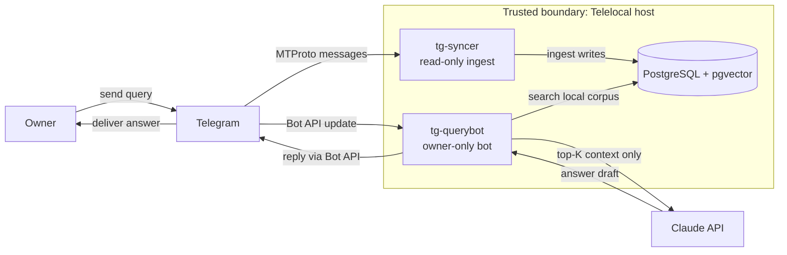
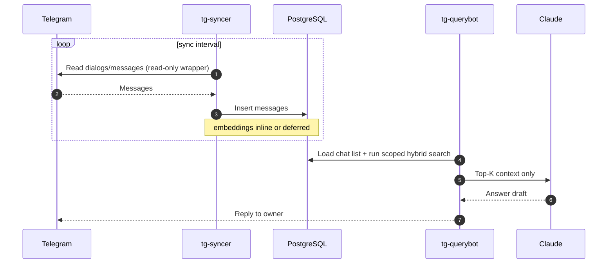

# Telelocal

Telelocal is a local-first, security-hardened Telegram assistant. 

It ingests messages from your Telegram account (within configured scope) into a local PostgreSQL database, then answers questions from that local index through a private Telegram bot interface.

---

## Table of Contents

- [What This Project Is For](#what-this-project-is-for)
- [Architecture At A Glance](#architecture-at-a-glance)
- [Security Design](#security-design)
- [Ingestion And Query Pipeline](#ingestion-and-query-pipeline)
- [Quick Start](#quick-start)
- [Operational UX](#operational-ux)
- [Repository Layout](#repository-layout)
- [Threat Model And Known Limits](#threat-model-and-known-limits)
- [Documentation Map](#documentation-map)
- [License](#license)

---

## What This Project Is For

**Telelocal exists for a specific workflow:**

- You have many Telegram chats (especially groups) with different contexts.
- Important asks and decisions get buried quickly.
- You need fast cross-chat retrieval and summaries.
- You want to keep your searchable corpus local, with strict security boundaries.

**Typical questions:**

> "What needs my attention from the past 24 hours?"
> "Can you summarize all my recent chats for the past 3 days?"
> "What did team X decide about pricing this week?"
> "Show where I was mentioned and whether a response is needed."

**Core intent:**

- Local-first data ownership
- Security-first isolation and credential handling
- Practical coverage for large chat sets

---

## Architecture At A Glance

Telelocal runs two core services inside one host boundary:

1. `tg-syncer` ingests Telegram history (read-only) into a local DB.
2. `tg-querybot` answers owner questions from that local DB and sends replies back in Telegram.

### System Overview



For deeper component and threat detail, see the [Security Model](tg-assistant/docs/SECURITY_MODEL.md).

---

## Security Design

Security in Telelocal is layered, not single-control:

| Layer | Control | Goal |
|---|---|---|
| Application | `ReadOnlyTelegramClient` allowlist (default deny) | Prevent Telegram write actions in syncer |
| Identity | Dedicated users: `tg-syncer`, `tg-querybot` | Reduce lateral movement |
| Database | `syncer_role` write-limited, `querybot_role` read-only on messages | Minimize blast radius |
| Network | nftables per service/UID egress policy | Block arbitrary exfiltration |
| Credentials | `LoadCredentialEncrypted` / `systemd-creds` | No plaintext secrets on disk |
| Auditing | Structured audit log | Forensics + anomaly review |

### Key implementation details

- `ReadOnlyTelegramClient` is an allowlist with default deny (`get_messages`, `iter_messages`, `get_dialogs`, `iter_dialogs`, `get_entity`, `get_participants`, `get_me`, `download_profile_photo`, `connect`, `disconnect`, `is_connected`).
- `tg-querybot` is owner-only at filter registration and handler level.
- Systemd units use hardening controls such as `NoNewPrivileges=true`, `ProtectSystem=strict`, `ProtectHome=true`, `PrivateTmp=true`, dropped capabilities, and restricted address families.
- Credentials are injected via `LoadCredentialEncrypted=` and decrypted only for service runtime.
- Querybot egress is DNS-refreshed IP-set based (`api.telegram.org`, `api.anthropic.com`), and syncer egress is limited to Telegram MTProto ranges.
- DB role split enforces least privilege (`syncer_role` write-limited for ingestion path; `querybot_role` read-only on message corpus).

---

## Ingestion And Query Pipeline



Ingestion uses freshest-first ordering, configurable chat-type scope, and optional deferred embeddings. Queries go through intent extraction, hybrid retrieval (FTS + vector), and scoped synthesis — non-owner requests are silently ignored.

For full pipeline detail and security properties, see the [Security Model](tg-assistant/docs/SECURITY_MODEL.md).

---

## Quick Start

```bash
git clone https://github.com/obheda12/telelocal.git
cd telelocal/tg-assistant
sudo ./scripts/setup.sh
```

Then:

```bash
telelocal status
telelocal sync-status
telelocal logs
```

Recommended immediately after first deploy:

```bash
sudo ./tests/security-verification.sh
```

For full deployment details and troubleshooting:

- [Quick Start guide](tg-assistant/docs/QUICKSTART.md)

---

## Operational UX

Everything is managed through the `telelocal` CLI:

```
telelocal setup          # Full guided deployment (sudo)
telelocal status         # Service health, credentials, DB counts
telelocal sync-status    # Ingestion progress per chat
telelocal logs           # Tail service logs
telelocal update <path>  # Deploy new code safely (sudo)
telelocal wipe           # Destroy all credentials and state (sudo)
```

The bot accepts natural language queries ("What needs my attention from the last 24 hours?") as well as structured commands:

- `/mentions 1d quick` — triage items needing your reply
- `/bd 3d detailed` — open questions and unanswered asks
- `/summary 1w quick` — cross-chat recap
- `/fresh 25 quick` — snapshot of most active chats

---

## Repository Layout

```text
tg-assistant/
  config/      # settings + system prompt
  docs/        # quickstart, security model, hardening notes
  nftables/    # egress policy template
  scripts/     # setup, update, ops helpers
  src/
    syncer/    # ingestion pipeline
    querybot/  # query + response pipeline
    shared/    # db/secrets/audit/safety shared utilities
  systemd/     # service and timer units
  tests/       # unit/integration/security checks
```

---

## Threat Model And Known Limits

### High-value assets and actors

**Highest-value assets:**

- Telethon session + session encryption key (account-level impact if misused)
- bot token and Claude API key
- local message corpus and audit logs

**Key threats:**

| Threat | Severity | Primary controls |
|---|---|---|
| Telethon session theft/use | Critical | encrypted session at rest, credential isolation, host hardening |
| Unintended Telegram writes | Critical | read-only Telethon wrapper allowlist (default deny) |
| Exfiltration from compromised service | High | per-service nftables egress restrictions |
| Unauthorized bot access | High | owner-only filter + handler guard |
| Prompt injection in synced content | Medium | untrusted-context prompt design, scoped retrieval, no direct write path |

---

## Documentation Map

- Deployment, usage, and troubleshooting: [tg-assistant/docs/QUICKSTART.md](tg-assistant/docs/QUICKSTART.md)
- Security model, threat catalog, and incident response: [tg-assistant/docs/SECURITY_MODEL.md](tg-assistant/docs/SECURITY_MODEL.md)
- Telethon hardening details: [tg-assistant/docs/TELETHON_HARDENING.md](tg-assistant/docs/TELETHON_HARDENING.md)

---

## License

MIT License.

Dependencies:

- Telethon: MIT
- python-telegram-bot: LGPL-3.0
- Claude API usage: Anthropic Terms
