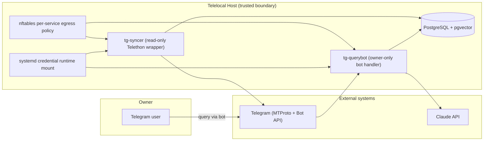

# Architecture

Concise architecture reference for Telelocal.

For full security rationale and threat analysis, see:

- `SECURITY_MODEL.md`
- `THREAT_MODEL.md`

---

## 1. System Context



---

## 2. Component Responsibilities

| Component | Primary role | Critical controls |
|---|---|---|
| `tg-syncer` | Ingest configured Telegram chats into local DB | `ReadOnlyTelegramClient`, service sandbox, nftables egress allowlist, dedicated credentials |
| `tg-querybot` | Owner-only query interface over local corpus | owner-only filters/guards, read-only DB role on corpus, nftables API allowlist |
| PostgreSQL (`messages`, `chats`, `audit_log`) | Local storage + retrieval | role separation (`syncer_role` vs `querybot_role`), local socket auth mapping |
| systemd credentials | Runtime secret delivery | `LoadCredentialEncrypted`, service-private credential directory |
| nftables (`inet tg_assistant_isolation`) | Kernel-level outbound control | per-service UID rules, default drop for non-allowlisted destinations |

---

## 3. Trust Boundaries

| Boundary | Trusted | Notes |
|---|---|---|
| Host boundary | Host OS controls, systemd, nftables, local DB | Main security anchor for process and data isolation |
| Telegram boundary | Telegram transport + message source | Required external dependency; message content treated as untrusted |
| LLM boundary | Claude API | Scoped/top-K context leaves host for synthesis |

---

## 4. Security Architecture (Layered)

| Layer | Controls | Security objective |
|---|---|---|
| Process isolation | dedicated users, systemd hardening directives | reduce privilege and lateral movement |
| Credential handling | encrypted credstore + runtime injection | avoid plaintext secret sprawl |
| Network egress | nftables per-service allowlists | constrain exfiltration and C2 |
| Application controls | Telethon read-only allowlist, owner-only bot checks | prevent unintended writes and unauthorized bot access |
| Data plane controls | DB role separation, scoped retrieval | limit mutation and reduce exposure surface |
| Auditability | file + DB audit events | support investigation and anomaly detection |

---

## 5. Compromise Containment Snapshot

| Compromised component | Likely capability | Constraints still active |
|---|---|---|
| `tg-querybot` process | read query corpus + call allowed external APIs | cannot mutate message corpus via DB role; cannot egress arbitrarily |
| `tg-syncer` process | read Telegram path + write ingest path | bounded by egress allowlists and service sandbox; write Telethon methods blocked by wrapper unless bypassed in-process |
| `querybot_role` | read corpus tables + write audit rows | no message/corpus mutation grants |

Important caveat:

- root or kernel compromise can bypass most user-space controls.

---

## 6. Runtime Verification

```bash
telelocal status
telelocal sync-status
sudo ./tests/security-verification.sh
sudo nft list table inet tg_assistant_isolation
tail -n 200 /var/log/tg-assistant/audit.log
```

---

## 7. Related Docs

- `SECURITY_MODEL.md` (authoritative security model)
- `THREAT_MODEL.md` (STRIDE-aligned threat summary)
- `TELETHON_HARDENING.md` (Telethon-specific safeguards)
- `QUICKSTART.md` (deployment and day-2 operations)
