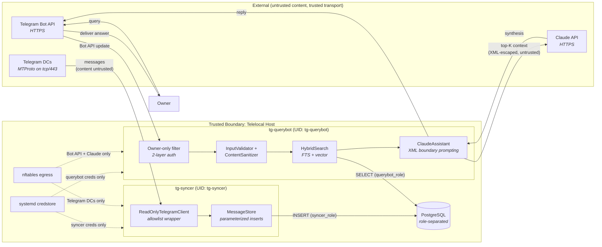
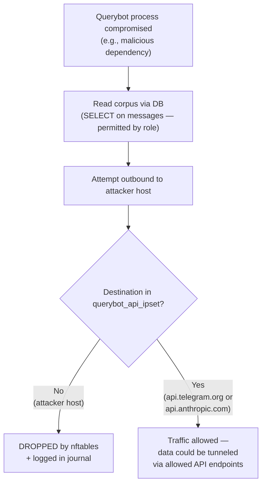
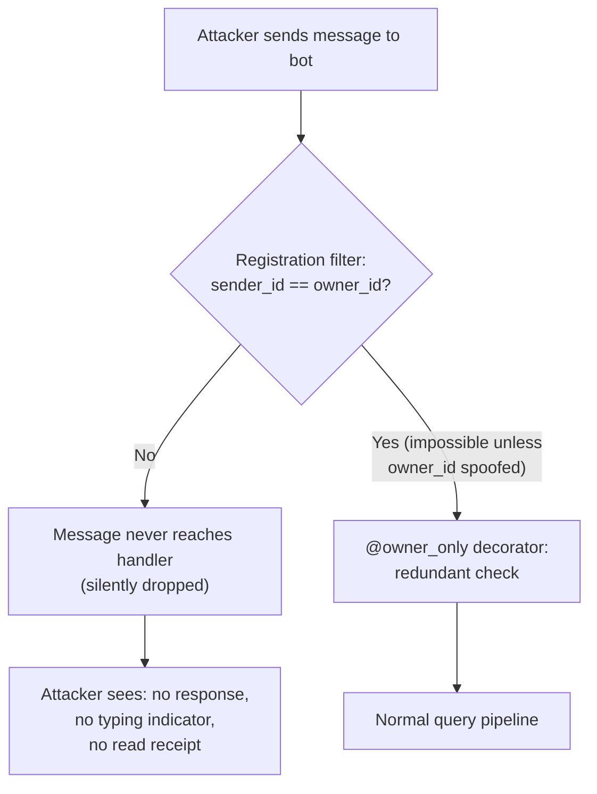
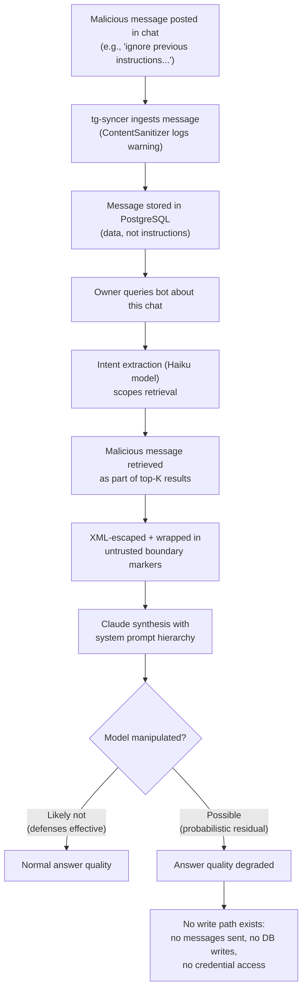
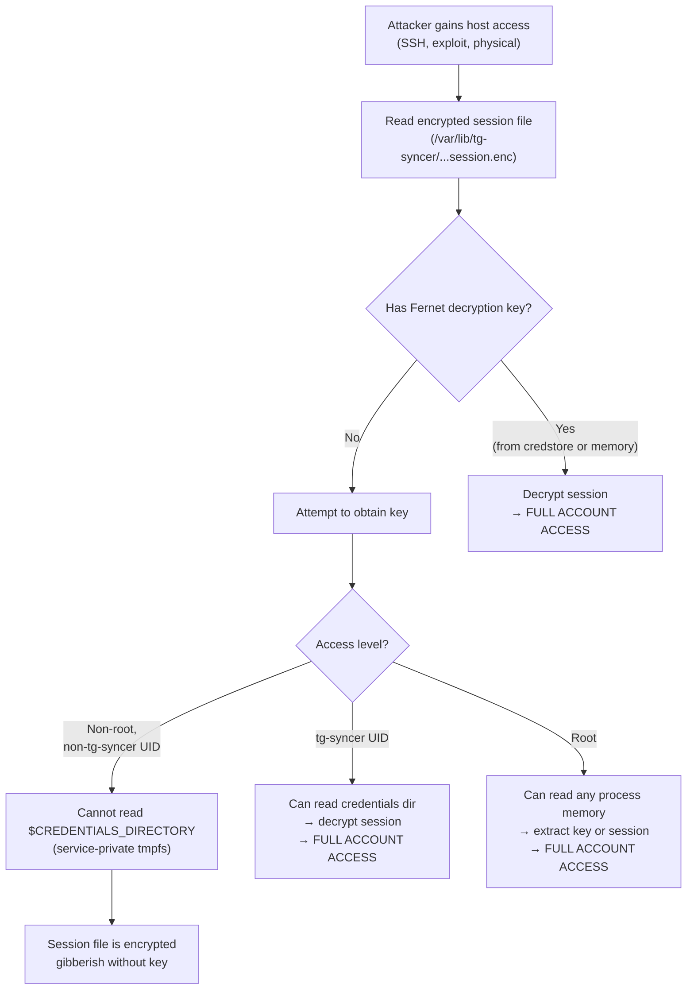
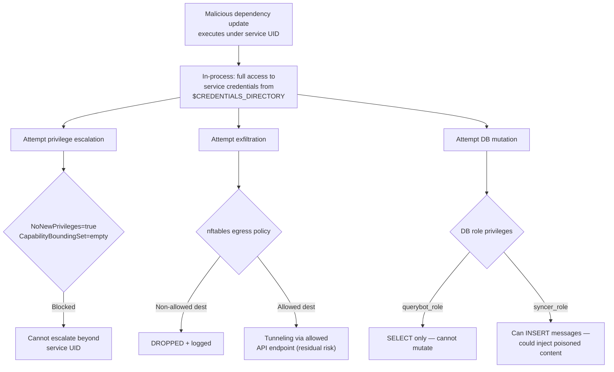
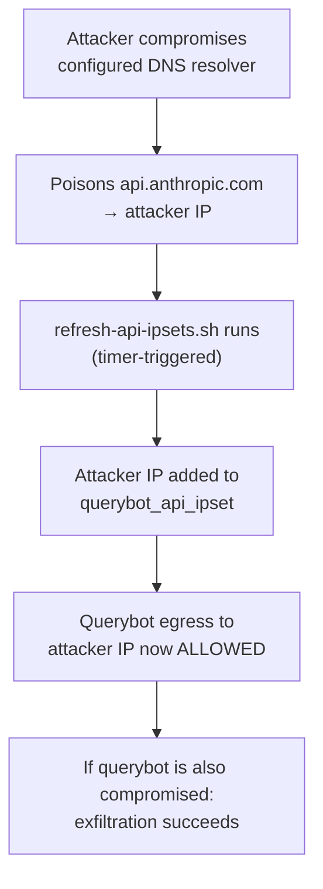

# Security Model

This is the **authoritative security reference** for Telelocal.

It describes:

- what assets matter,
- which controls exist in code and runtime,
- how those controls interact,
- where risk still remains.

**Related docs:**

- [`TELETHON_HARDENING.md`](TELETHON_HARDENING.md) — Telethon-specific controls and emergency procedures
- [`QUICKSTART.md`](QUICKSTART.md) — deployment and operational checks
- [`../../README.md`](../../README.md) — project overview and architecture diagrams
- [`../tests/prompt-injection-tests.md`](../tests/prompt-injection-tests.md) — prompt injection test suite

**Use this doc by goal:**

| Goal | Sections |
|---|---|
| Quick risk posture | 1, 6, 7, 11 |
| Architecture and data flows | 3 |
| Control details | 5 |
| Operational checks | 9, 10 |
| Assumptions and accepted risks | 11, 12 |

## Table of Contents

- [1. Executive Summary](#1-executive-summary)
- [2. Scope And Security Goals](#2-scope-and-security-goals)
- [3. System Context And Trust Boundaries](#3-system-context-and-trust-boundaries)
- [4. Assets And Threat Actors](#4-assets-and-threat-actors)
- [5. Defense-In-Depth Controls](#5-defense-in-depth-controls)
- [6. Compromise Blast Radius](#6-compromise-blast-radius)
- [7. Threat Catalog (STRIDE-Aligned)](#7-threat-catalog-stride-aligned)
- [8. Attack Path Walkthroughs](#8-attack-path-walkthroughs)
- [9. Security Verification And Monitoring](#9-security-verification-and-monitoring)
- [10. Incident Response](#10-incident-response)
- [11. Accepted Risks](#11-accepted-risks)
- [12. Assumptions And Review Cadence](#12-assumptions-and-review-cadence)
- [Appendix A: Hardening Directive Reference](#appendix-a-hardening-directive-reference)
- [Appendix B: Full-Disk Encryption (LUKS) Recommendation](#appendix-b-full-disk-encryption-luks-recommendation)

---

## 1. Executive Summary

### Critical fact

**A usable Telethon session is equivalent to account-level Telegram access.** If an attacker can operate that session, they can read all messages, send as the account holder, delete conversations, change 2FA, and modify the profile — with no scope limitation.

### Deployment model

Telelocal is a **single-user, single-host** system. One owner, one Raspberry Pi (or similar), one Telegram account. There is no multi-tenant isolation, no web-facing interface, and no shared access model. Every security control is designed around this constraint.

### Core design decision

Telelocal accepts MTProto session risk to gain broad chat coverage, then reduces exposure with **layered controls**:

1. **Process isolation** — dedicated system users, systemd sandboxing
2. **Credential handling** — encrypted at rest, per-service injection, no shared secrets
3. **Network egress restriction** — kernel-level nftables per service UID
4. **Read-only application boundary** — allowlist wrapper on Telethon client
5. **Least-privilege DB access** — role separation, querybot is read-only
6. **Prompt injection defense** — multi-layer input validation, XML boundary prompting
7. **Auditability** — dual-sink structured logging for forensics

### What this model does well

- **Prevents accidental writes** to Telegram via the syncer path (default-deny allowlist).
- **Constrains blast radius** — compromise of one service does not directly compromise the other.
- **Blocks arbitrary exfiltration** — kernel-level egress policy survives application compromise.
- **Makes verification tractable** — concrete checks, clear indicators, documented runbooks.

### What this model cannot guarantee

- **Full host/root compromise** remains high-impact — in-memory credentials are accessible.
- **Kernel-level escape** defeats all user-space isolation.
- **LLM prompt injection** cannot be deterministically eliminated — defenses are probabilistic.
- **Cloud provider visibility** — Claude API receives message excerpts during query synthesis.

---

## 2. Scope And Security Goals

### In scope

- **Services:** `tg-syncer`, `tg-querybot`, PostgreSQL role model
- **Infrastructure:** systemd service hardening, nftables per-service policy
- **Credentials:** loading, storage, injection, and separation model
- **Data flows:** message ingestion pipeline, query synthesis pipeline, trust boundary crossings
- **Defenses:** prompt injection mitigation, input validation, audit logging

### Out of scope

- Telegram platform internals and MTProto protocol security
- Anthropic internal controls and model safety
- Supply-chain attestation beyond pinned dependency strategy
- Hardware side-channel resistance beyond practical host hardening

### Security goals

| # | Goal | Validates against |
|---|---|---|
| **G1** | Prevent unintended Telegram write actions from the syncer path | T2 (accidental writes) |
| **G2** | Prevent broad credential leakage via files, config, or runtime shortcuts | T1, T5 (credential theft) |
| **G3** | Reduce exfiltration options from compromised service processes | T3 (data exfil) |
| **G4** | Enforce owner-only query interface behavior | T4 (unauthorized access) |
| **G5** | Preserve forensic trail for security investigations | T9 (audit integrity) |
| **G6** | Prevent untrusted synced content from subverting query synthesis | T7 (prompt injection) |

---

## 3. System Context And Trust Boundaries

### 3.1 Architecture Overview

Telelocal runs **two isolated services** on a single host, connected only through a shared PostgreSQL database:

- **`tg-syncer`** — connects to Telegram via MTProto (user account session), reads messages through a strict allowlist wrapper, writes them into PostgreSQL. **No outbound path except Telegram DCs.**
- **`tg-querybot`** — receives owner queries via Telegram Bot API, searches the local corpus, sends top-K context to Claude for synthesis, returns answers. **No access to syncer credentials or session.**

The services share **no direct IPC, no shared credentials, and no shared writable filesystem paths**. Compromise of one does not directly grant access to the other.

### 3.2 Data Flow Diagram

Every arrow below represents a data flow that crosses or operates within a trust boundary. **Solid lines** are data flows; **dotted lines** are enforcement/configuration relationships.



### 3.3 Trust Boundary Crossings

Each row is a point where data crosses a trust boundary — the places where attacks happen.

| Boundary crossing | Protocol | Data flowing | Trust level | Key risk at this boundary |
|---|---|---|---|---|
| **Telegram DCs → Syncer** | MTProto (AES-256-IGE) | Synced messages, metadata | **Transport trusted** (Telegram encryption); **content untrusted** (any chat participant can inject) | Prompt injection payloads in message content |
| **Syncer → Database** | Unix socket (peer auth) | Message inserts, embedding updates | **Trusted** (kernel-verified UID → DB role) | Compromised syncer limited to INSERT + UPDATE(embedding) |
| **Owner → Bot API → Querybot** | HTTPS | User queries | **Owner-verified** at application layer (2-layer filter) | Bot token compromise = impersonation of bot |
| **Database → Querybot** | Unix socket (peer auth) | SELECT results (messages, chats) | **Trusted** (kernel-verified UID → read-only role) | Querybot cannot mutate corpus by design |
| **Querybot → Claude API** | HTTPS (TLS 1.3) | Top-K message excerpts + user question | **Sanitized but not redacted** — cloud provider sees content | Message content visible to Anthropic; injection payloads reach the model |
| **Syncer ↔ Querybot** | **None** (no direct IPC) | N/A | **Isolated by architecture** | Compromise of one does not directly chain to the other |

### 3.4 Trust Level Definitions

| Trust level | Meaning | Examples |
|---|---|---|
| **Trusted** | Under operator control; integrity verified by kernel or cryptography | Local database via Unix socket peer auth, systemd credstore decryption |
| **Transport-trusted** | Wire-level encryption prevents eavesdropping/tampering, but the sending endpoint is not under our control | Telegram MTProto channel — encrypted in transit, but content originates from arbitrary chat participants |
| **Owner-verified** | Application-layer authentication confirms the owner's identity | Bot API messages filtered by `owner_telegram_id` at registration and handler level |
| **Untrusted** | Content originates from sources outside operator control and may be adversarial | Synced message text, sender display names, chat titles, forwarded message metadata |

---

## 4. Assets And Threat Actors

### 4.1 High-Value Assets

| Asset | Impact if compromised | Storage location | Primary protection |
|---|---|---|---|
| **Telethon session** (encrypted) | **Full Telegram account access** — read, send, delete, change 2FA | `/var/lib/tg-syncer/...session.enc` | Fernet encryption (AES-128-CBC + HMAC), keychain-stored key, 0600 perms |
| **Session encryption key** | Decrypts Telethon session → account access | `LoadCredentialEncrypted` runtime | systemd credstore, machine-bound encryption |
| **Bot token** | Bot impersonation, owner interaction interception | `LoadCredentialEncrypted` runtime | Per-service credential injection, not on disk |
| **Claude API key** | Billing abuse, model access from any host | `LoadCredentialEncrypted` runtime | Per-service injection; nftables limits on-host use |
| **Message corpus** | Sensitive chat history, relationship metadata, decision records | PostgreSQL `messages` table | Role separation, Unix socket auth, host boundary |
| **Embedding vectors** | Nearest-neighbor queries can infer message content | PostgreSQL `messages.embedding` column | Same DB role controls as message corpus |
| **Audit logs** | Forensic trail, behavior traceability | `/var/log/tg-assistant/audit.log` + DB `audit_log` | Dual-sink writes, restricted DB insert-only role |

### 4.2 Threat Actors

| Actor | Capability | Typical objective | Primary attack surface |
|---|---|---|---|
| **Opportunistic internet attacker** | Low–medium | RCE, credential theft, botnet recruitment | Network-exposed services (none by default — no listening ports) |
| **Targeted attacker** | Medium–high | Message corpus exfiltration, account takeover | Host compromise, credential theft, session extraction |
| **Chat participant with injection intent** | Low–medium | Manipulate bot summaries, extract secrets via LLM | Synced message content → prompt injection in query context |
| **Compromised Python dependency** | High (in-process) | Arbitrary code execution under service UID | Supply chain; constrained by nftables + DB role + sandbox |
| **Physical thief** | Medium–high | Offline disk extraction, credential recovery | Encrypted session file, credstore blobs; mitigated by LUKS |

> **Note on the "chat participant" actor:** This is distinct from a generic internet attacker. The attack vector is *indirect* — malicious content is written into a Telegram chat, synced into the local database by `tg-syncer`, and later retrieved as LLM context when the owner queries the bot. The attacker never interacts with the bot directly.

---

## 5. Defense-In-Depth Controls

### 5.1 Service Isolation and Host Hardening

**Design intent:** Each service runs as a dedicated unprivileged system user (`tg-syncer`, `tg-querybot`) with systemd sandbox directives that restrict filesystem access, capabilities, and kernel interactions.

**Active directives** (source of truth: `systemd/tg-syncer.service`, `systemd/tg-querybot.service`):

| Category | Directives | Effect |
|---|---|---|
| **Privilege restriction** | `NoNewPrivileges=true`, `CapabilityBoundingSet=` (empty), `AmbientCapabilities=` (empty) | Cannot gain new privileges or capabilities after launch |
| **Filesystem isolation** | `ProtectSystem=strict`, `ProtectHome=true`, `PrivateTmp=true` | Read-only root, no access to /home, isolated /tmp |
| **Kernel protection** | `ProtectKernelTunables=true`, `ProtectKernelModules=true`, `ProtectKernelLogs=true`, `ProtectControlGroups=true` | Cannot modify kernel state |
| **Process isolation** | `ProtectProc=invisible`, `ProcSubset=pid`, `RestrictNamespaces=true` | Cannot see other processes or create namespaces |
| **Network restriction** | `RestrictAddressFamilies=AF_INET AF_INET6 AF_UNIX` | Only IPv4, IPv6, and Unix sockets |
| **Architecture lock** | `SystemCallArchitectures=native` | Prevents 32-bit syscall ABI exploitation |

**Current tradeoffs:**

- `MemoryDenyWriteExecute=false` — required for Python 3.13 JIT compatibility.
- `SystemCallFilter` — not enabled due to Python runtime compatibility constraints.
- **Implication:** Hardening is strong but does not include maximal seccomp or W^X enforcement. Revisit if the runtime stack evolves to allow re-enabling.

---

### 5.2 Network Egress Controls (nftables)

**Design intent:** Even if an attacker achieves code execution within a service process, they cannot exfiltrate data to arbitrary destinations. Egress is restricted at the **kernel netfilter layer**, scoped by service user identity (`meta skuid`).

**Policy table:** `inet tg_assistant_isolation`

| Service | Allowed egress | Everything else |
|---|---|---|
| **`tg-syncer`** | DNS to resolver IP sets; MTProto to Telegram DC ranges (`tcp/443`) | **Dropped and logged** |
| **`tg-querybot`** | DNS to resolver IP sets; HTTPS to `api.telegram.org` + `api.anthropic.com` IP sets | **Dropped and logged** |

**Dynamic IP set refresh:**

- **Script:** `scripts/refresh-api-ipsets.sh`
- **Scheduling:** `tg-refresh-api-ipsets.timer` + `tg-refresh-api-ipsets.service`
- **Mechanism:** DNS resolution of API hostnames → nftables set update

**Critical assumption:** The configured DNS resolver is trusted. If a resolver is compromised, API IP allowlists could be poisoned to include attacker-controlled destinations. See [T11](#7-threat-catalog-stride-aligned) and [Attack Path F](#86-path-f-dns-based-nftables-bypass).

---

### 5.3 Credential Security Model

**Design intent:** No plaintext secrets on disk, no shared credentials between services, no environment variable leakage in production.

#### Storage and injection path

```
/etc/credstore.encrypted/
  ├── tg-assistant-api-id          ← encrypted at rest (systemd-creds)
  ├── tg-assistant-api-hash
  ├── session_encryption_key
  ├── tg-assistant-bot-token
  └── tg-assistant-claude-api-key
         │
         ▼  (on service start)
  systemd LoadCredentialEncrypted= decrypts into
  $CREDENTIALS_DIRECTORY/<key_name>  (service-private tmpfs, readable only to service UID)
         │
         ▼  (at runtime)
  shared.secrets.get_secret("<key_name>")  reads from credentials directory
```

#### Runtime lookup order

`shared.secrets.get_secret()` checks sources in this order (first match wins):

| Priority | Source | Context |
|---|---|---|
| **1** | `$CREDENTIALS_DIRECTORY/<key_name>` | **Production path** — systemd-managed, per-service |
| **2** | `secret-tool` keychain lookup | Fallback for interactive/development use |
| **3** | `TG_ASSISTANT_<KEY_NAME>` env var | **Development only** — requires explicit opt-in via `TG_ASSISTANT_ALLOW_ENV_SECRETS=1` |

**Production recommendation:** Keep environment fallback disabled (default). Rely solely on `LoadCredentialEncrypted`.

#### Per-service credential separation

| Credential | `tg-syncer` | `tg-querybot` |
|---|---|---|
| `session_encryption_key` | Yes | **No** |
| `tg-assistant-api-id` | Yes | **No** |
| `tg-assistant-api-hash` | Yes | **No** |
| `tg-assistant-bot-token` | **No** | Yes |
| `tg-assistant-claude-api-key` | **No** | Yes |

**Security property:** A compromised querybot cannot access the Telethon session or MTProto credentials. A compromised syncer cannot access the bot token or Claude API key.

---

### 5.4 Read-Only Telegram Wrapper (Syncer)

**Design intent:** Telethon's `TelegramClient` has full account-level capability — send messages, delete conversations, change 2FA. The `ReadOnlyTelegramClient` wrapper enforces a **strict allowlist with default deny**, ensuring the syncer can only perform read operations.

**Implementation:** `src/syncer/readonly_client.py`

#### Allowed methods (exhaustive)

| Category | Methods |
|---|---|
| **Read operations** | `get_messages`, `iter_messages`, `get_dialogs`, `iter_dialogs`, `get_entity`, `get_participants`, `get_me`, `download_profile_photo` |
| **Lifecycle** | `connect`, `disconnect`, `is_connected` |

**Everything else raises `PermissionError` and is logged as a security event.**

#### Why allowlist, not blocklist

| Scenario | Blocklist result | Allowlist result |
|---|---|---|
| New read method added to Telethon | Allowed (correct) | Blocked until reviewed (**safe**) |
| New write method added to Telethon | **Allowed (DANGEROUS)** | Blocked by default (**safe**) |
| Method renamed in Telethon update | Old blocked, **new allowed** | Old allowed, new blocked (**safe**) |

#### Wrapper integrity

- The underlying `TelegramClient` is stored outside instance attributes (via `WeakKeyDictionary`), preventing `client._client` extraction through normal attribute access.
- `__setattr__` raises `PermissionError` — the wrapper is immutable after construction.
- **Residual risk:** An attacker with arbitrary Python execution in-process can introspect module internals to reach the underlying client. This is why kernel/network/systemd isolation layers are still required.

**Full Telethon method inventory and risk classification:** See [`TELETHON_HARDENING.md` Section 5](TELETHON_HARDENING.md#5-telethon-method-inventory).

---

### 5.5 Owner-Only Bot Access (Querybot)

**Design intent:** The querybot responds exclusively to the account owner. Non-owner messages are silently dropped with no response, minimizing information leakage to probing accounts.

**Two-layer enforcement:**

| Layer | Mechanism | Implementation |
|---|---|---|
| **Registration filter** | `filters.User(owner_id)` applied at handler registration time | `src/querybot/main.py` — handlers never fire for non-owner |
| **Handler guard** | `@owner_only` decorator checks `sender_id` redundantly | `src/querybot/handlers.py` — defense-in-depth; logs violations |

**Behavior on non-owner message:** Silent drop. No error response, no typing indicator, no read receipt. Attacker learns only that the bot exists (unavoidable via Telegram's bot discovery).

---

### 5.6 Prompt Injection Defense Chain

**Design intent:** Synced message content is untrusted — any chat participant can write arbitrary text that will eventually be retrieved as LLM context. The defense is **multi-layered and probabilistic**, not a single filter.

#### Layer-by-layer defense

| Layer | Component | What it does | Implementation |
|---|---|---|---|
| **1. Input validation** | `InputValidator` | Rejects messages exceeding length limit (default 4000 chars), blocks null bytes (`\x00`), warns on >90% whitespace | `src/shared/safety.py:119-158` |
| **2. Injection pattern detection** | `ContentSanitizer` | Scans for 5 regex patterns: "ignore previous instructions", LLM instruction tokens (`[INST]`, `[/INST]`), special tokens (`<\|...\|>`), null bytes. **Logs warnings; does not block** (avoids false positives on legitimate messages) | `src/shared/safety.py:74-111` |
| **3. Intent extraction isolation** | Separate Haiku model call | User question is parsed into a structured `QueryIntent` (search terms, chat IDs, sender, date range) by a **lightweight model**, not by the synthesis model. Chat IDs are validated against known IDs only. | `src/querybot/llm.py:151-241` |
| **4. Scoped retrieval** | `HybridSearch` with filters | Only messages matching the extracted intent are retrieved — not the full corpus. Limits attacker control over which injected content reaches the synthesis model. | `src/querybot/search.py` |
| **5. XML boundary markers** | `trust_level="untrusted"` | Retrieved messages are wrapped in explicit XML: `<message_context source="synced_telegram_messages" trust_level="untrusted">`. System instructions sit above this block in prompt hierarchy. | `src/querybot/llm.py:247-315` |
| **6. Content escaping** | Full XML entity escaping | All message content is escaped (`<` → `&lt;`, `>` → `&gt;`, `&` → `&amp;`) before insertion into prompt, preventing XML tag injection. | `src/querybot/llm.py` |
| **7. System prompt hierarchy** | Instructions above untrusted data | The system prompt (trusted) appears first; untrusted message context appears later and is explicitly labeled as data, not instructions. | `config/system_prompt.md` + `src/querybot/llm.py` |
| **8. No write path** | Architectural constraint | LLM output is rendered as text in a Telegram reply. There is **no code path** from model output to Telegram account actions, database mutations, file writes, or credential access. | Entire querybot architecture |

**Residual risk:** LLM reasoning can still be subtly influenced by adversarial content in the context window. Defenses reduce the probability and constrain the blast radius (to answer quality only), but cannot guarantee deterministic immunity.

**Test suite:** See [`tests/prompt-injection-tests.md`](../tests/prompt-injection-tests.md) for 20+ structured test cases covering direct overrides, encoded instructions, context manipulation, social engineering, multi-stage attacks, and indirect injection vectors.

---

### 5.7 Query Rate Limiting

**Design intent:** Prevent API cost runaway and abuse if the bot token is compromised or an automation loop is accidentally created.

**Implementation:** Sliding-window rate limiter in `src/querybot/llm.py:125-145`.

| Parameter | Default | Effect |
|---|---|---|
| **Window** | 60 seconds | Timestamps older than window are discarded |
| **Max queries per window** | 20 (configurable via `max_queries_per_minute`) | Exceeding the cap causes the caller to sleep until the oldest entry expires |

**Security property:** Even with a valid bot token, an attacker cannot cause unbounded Claude API spend. The rate limiter is enforced in-process before any API call.

---

### 5.8 Database Security Controls

**Design intent:** Each service gets the minimum database privileges required for its function. The query path cannot mutate the message corpus.

#### Authentication model

- **Unix socket peer auth** — PostgreSQL maps the connecting system user (kernel-verified UID) to a database role. No DB passwords in config files or application code.

#### Role privilege matrix

| Privilege | `syncer_role` | `querybot_role` |
|---|---|---|
| `SELECT` on `messages` | Yes | Yes |
| `INSERT` on `messages` | Yes | **No** |
| `UPDATE (embedding)` on `messages` | Yes | **No** |
| `SELECT` on `chats` | Yes | Yes |
| `INSERT, UPDATE` on `chats` | Yes | **No** |
| `INSERT` on `audit_log` | Yes | Yes |
| `SELECT` on `audit_log` | **No** | **No** |

**Security property:** A compromised querybot can read the corpus but cannot insert, update, or delete messages. A compromised syncer can insert messages but cannot read audit logs or access querybot-specific data paths.

#### SQL injection prevention

All queries use **asyncpg parameterized placeholders** (`$1`, `$2`, ...) — never string interpolation. This applies to message inserts (`src/syncer/message_store.py`), search queries (`src/querybot/search.py`), and audit log writes (`src/shared/audit.py`).

---

### 5.9 Audit Logging

**Design intent:** Provide a forensic trail that survives single-sink compromise and supports post-incident timeline reconstruction.

#### Dual-sink architecture

| Sink | Format | Location |
|---|---|---|
| **File** | JSON Lines (one event per line) | `/var/log/tg-assistant/audit.log` |
| **Database** | `audit_log` table (JSONB details) | PostgreSQL — both roles can `INSERT`, neither can `SELECT` |

#### Events logged

| Event category | Examples |
|---|---|
| **Sync operations** | Sync pass start/complete, message counts, errors |
| **Query operations** | Search terms, result counts, token costs |
| **Authorization decisions** | Owner-only filter blocks, denied access attempts |
| **Security events** | Blocked Telethon method calls, injection pattern detections |

#### Architecture notes

- **Async queue-driven writer** — queue size 1024, flush batch size 64.
- **Backpressure-aware** — producers block if queue is full (prevents event loss under load).
- **Safe shutdown** — flushes remaining queued records before closing.
- **Known limitation:** File I/O in `audit.py:74` is synchronous inside an async function. Low operational impact but technically blocks the event loop during file writes.

---

## 6. Compromise Blast Radius

What an attacker gains (and what remains constrained) for each compromised component.

| Compromised component | Attacker gains | Still constrained by |
|---|---|---|
| **`tg-querybot` process** | Read message corpus; call Telegram Bot API + Claude API; insert audit rows | Cannot modify messages (DB role); cannot egress to arbitrary hosts (nftables); no access to syncer credentials |
| **`tg-syncer` process** | Read Telegram messages via MTProto; insert/update messages in DB; access syncer credentials | Cannot call non-allowlisted Telethon methods (wrapper); cannot egress beyond Telegram DCs (nftables); no access to querybot credentials |
| **Claude API key (extracted, used externally)** | Claude API access from any host; billing abuse; model usage | No access to local corpus, database, or Telegram; rate limits on Anthropic side |
| **Bot token (extracted, used externally)** | Send messages as bot, receive updates | Cannot access database or host resources; owner can revoke token |
| **`querybot_role` DB session** | Read corpus tables; insert audit rows | Cannot mutate messages; Unix socket auth prevents remote use |
| **Encrypted credstore blobs (disk theft)** | Offline possession of encrypted files | Not usable without host machine key context; LUKS further mitigates |

**Important:** Root or kernel compromise bypasses most of the above. In-memory credentials, decrypted sessions, and raw database access become available. Host hardening and patch cadence are the primary mitigations.

---

## 7. Threat Catalog (STRIDE-Aligned)

### Severity rationale

Severity is assessed as **likelihood x impact** for the Telelocal deployment model (single-user, single-host, no internet-facing ports):

- **Critical** = high impact + realistic attack path exists
- **High** = significant impact + attack path requires elevated access or specific conditions
- **Medium** = moderate impact or low likelihood under normal operation

### Threat table

| ID | Threat | STRIDE | Severity | Why this severity | Primary controls |
|---|---|---|---|---|---|
| **T1** | Telethon session theft and use | Spoofing / Elevation | **Critical** | Full account takeover; realistic via host compromise | Fernet encryption + credential isolation + host hardening + session rotation |
| **T2** | Unintended Telegram writes from sync path | Tampering | **Critical** | Impersonation as account holder; single wrapper failure enables | ReadOnlyTelegramClient allowlist (default deny) + blocked call logging |
| **T3** | Data exfiltration from compromised service | Information Disclosure | **High** | Corpus contains sensitive history; requires app compromise first | nftables per-service egress restrictions + no listening ports |
| **T4** | Unauthorized bot access | Spoofing | **High** | Could query private corpus; requires bot token or Telegram exploit | Owner-only 2-layer filter + silent drop behavior |
| **T5** | Cross-service credential abuse | Elevation | **High** | Could chain syncer compromise to bot or vice versa; requires host access | Per-service credential injection + dedicated system users |
| **T6** | Corpus theft via DB role misuse | Information Disclosure | **High** | Full chat history exposure; requires service or host compromise | Role separation + Unix socket peer auth + local-only DB |
| **T7** | Prompt injection via synced message content | Tampering | **Medium** | Affects answer quality; no write path limits blast radius; any chat participant can attempt | Multi-layer defense chain (section 5.6) + no LLM-to-action path |
| **T8** | Supply-chain compromise in Python dependency | Elevation | **Medium–High** | In-process code execution; constrained by sandbox + egress + DB role | Pinned deps + systemd sandbox + nftables + role separation |
| **T9** | Audit log suppression or tampering | Repudiation | **Medium** | Hinders forensics; requires service-level compromise | Dual-sink logging + insert-only DB role (no SELECT/DELETE) |
| **T10** | Telegram rate-limit or account ban | Availability | **Medium** | Disrupts sync; self-inflicted via aggressive patterns | Conservative pacing + jitter + configurable intervals |
| **T11** | DNS resolver poisoning widens nftables IP sets | Elevation | **Medium** | Enables exfil to attacker host via widened egress; requires resolver compromise | Trusted resolver assumption + refresh diff logging |
| **T12** | API cost runaway via query flooding | Availability | **Medium** | Billing abuse if bot token compromised; self-limiting | Sliding-window rate limiter (section 5.7) + Anthropic rate limits |

**Core residual risks by architecture:** T1 (session), T7 (prompt injection), and T8 (supply chain) remain non-zero regardless of controls applied.

---

## 8. Attack Path Walkthroughs

### 8.1 Path A: Exfiltration from compromised querybot

**Scenario:** Attacker achieves code execution in the `tg-querybot` process (e.g., via dependency compromise) and attempts to exfiltrate the message corpus.



**Expected outcome:** Arbitrary-destination exfiltration is blocked at the kernel layer. **Residual risk:** data could theoretically be tunneled via allowed API endpoints (e.g., encoded in Claude API requests or Bot API messages). This is a known limitation of IP-based egress controls.

---

### 8.2 Path B: Non-owner bot probing

**Scenario:** An attacker discovers the bot's username and sends it messages to probe for information or test for vulnerabilities.



**Expected outcome:** Probing accounts receive no signal beyond the bot's existence (discoverable via Telegram search — unavoidable).

---

### 8.3 Path C: Prompt injection via synced message

**Scenario:** A chat participant writes a malicious message designed to manipulate the bot's LLM responses when the owner later queries about that chat.



**Expected outcome:** Manipulation risk reduced through 8 defense layers. Blast radius limited to answer quality — no Telegram actions, no data mutations, no credential exposure.

---

### 8.4 Path D: Telethon session theft chain

**Scenario:** An attacker with some level of host access attempts to steal the Telethon session to gain full Telegram account control.



**Key takeaway:** The session theft chain requires either `tg-syncer` UID or root access. Controls that prevent this escalation (systemd sandbox, `NoNewPrivileges`, `ProtectProc=invisible`, no SUID binaries) are the critical barriers. **If root is compromised, session theft is assumed successful** — this is an accepted risk (section 11).

---

### 8.5 Path E: Supply-chain dependency compromise

**Scenario:** A malicious update to a Python dependency (e.g., Telethon, asyncpg, anthropic SDK) executes arbitrary code within a service process.



**Key takeaway:** Supply-chain compromise is **contained** to the compromised service's privilege envelope. Cross-service escalation requires breaking out of systemd sandboxing. The highest-risk scenario is a compromised syncer dependency that can both read Telegram messages (via MTProto) and potentially access the session encryption key.

---

### 8.6 Path F: DNS-based nftables bypass

**Scenario:** An attacker compromises the DNS resolver used by `scripts/refresh-api-ipsets.sh`, causing attacker-controlled IPs to be added to the querybot's egress allowlist.



**Key takeaway:** This is a **two-prerequisite attack** (resolver compromise + service compromise), but it defeats the egress control layer. **Detection:** Unexpected entries in nftables IP sets, logged by `tg-refresh-api-ipsets.service` in journal. **Mitigation:** Use trusted, hardened DNS resolvers (e.g., local unbound with DNSSEC validation).

---

## 9. Security Verification And Monitoring

### 9.1 Baseline checks

**Run after every deploy and after system updates:**

```bash
telelocal status                        # Service health, credentials, DB counts
telelocal sync-status                   # Ingestion progress per chat
sudo ./tests/security-verification.sh   # Automated security posture check
```

### 9.2 Ongoing monitoring

```bash
# Service runtime logs
telelocal logs

# Audit log tail (structured JSON, one event per line)
tail -n 200 /var/log/tg-assistant/audit.log

# API IP set refresh health (detect DNS poisoning)
journalctl -u tg-refresh-api-ipsets.service -n 50 --no-pager

# nftables rule inspection (verify egress policy intact)
sudo nft list table inet tg_assistant_isolation
```

### 9.3 Prompt injection verification

**Run periodically** using the structured test suite:

- [`tests/prompt-injection-tests.md`](../tests/prompt-injection-tests.md) — 20+ test cases across 6 categories (direct override, encoded instructions, context manipulation, social engineering, multi-stage attacks, indirect injection).

Procedure: Send test messages to a synced chat → wait for sync → query the bot → verify no credential disclosure, no SQL execution, no behavioral change.

### 9.4 High-signal indicators

| Signal | Severity | Likely cause | Recommended action |
|---|---|---|---|
| **Repeated blocked outbound** in service user journal logs | High | Process compromise or misconfiguration | Investigate immediately; check for dependency updates or unexpected code changes |
| **Repeated owner-only filter blocks** | Medium | Targeted probing of bot endpoint | Monitor frequency; consider if bot username should be changed |
| **Ingest volume collapse** without config change | Medium | Auth/session/rate-limit failure, or Telegram restriction | Check `telelocal sync-status` and syncer logs; verify session health |
| **Sudden query volume spike** | Medium–High | Bot token compromise or automation loop | Check audit log for unusual query patterns; rotate bot token if unexplained |
| **Unexpected IP set refresh diff** | High | Possible DNS poisoning | Compare against known API IP ranges; switch to validated resolver |
| **Blocked Telethon method calls** in audit log | Critical | Bug in sync code, or compromised dependency attempting writes | **Stop syncer immediately**; investigate call source |

---

## 10. Incident Response

### Step-by-step procedure

If compromise is suspected:

**1. Stop services immediately**

```bash
sudo systemctl stop tg-syncer tg-querybot
```

**2. Preserve evidence**

```bash
sudo cp -a /var/log/tg-assistant/ /root/incident-$(date +%Y%m%d)/
journalctl -u tg-syncer -u tg-querybot --since "24 hours ago" > /root/incident-$(date +%Y%m%d)/journal.log
```

**3. Revoke and rotate credentials**

Perform all revocations **from your phone or another trusted device** — not from the potentially-compromised host:

| Credential | Revocation method |
|---|---|
| **Telethon session** | Telegram Settings > Devices > terminate the session |
| **Telegram API ID/hash** | Regenerate at my.telegram.org |
| **Bot token** | Revoke via @BotFather |
| **Claude API key** | Rotate in Anthropic Console |
| **Session encryption key** | Regenerate via `systemd-creds` |

**4. Verify security posture**

```bash
sudo ./tests/security-verification.sh
```

**5. Recreate session and restart**

Only after investigation is complete and all credentials are rotated:

```bash
sudo ./scripts/setup-telethon-session.sh
sudo systemctl start tg-syncer tg-querybot
```

### Critical reminder

**If session compromise is plausible, treat it as full account compromise until the session is revoked from the Telegram Devices list.** A Telethon session has no scope limitation — it is equivalent to being logged in on another device.

---

## 11. Accepted Risks

| Risk | Why accepted | Operator expectation |
|---|---|---|
| **In-memory credential exposure under root compromise** | Unavoidable for any active runtime that must use decrypted secrets | Prioritize host hardening, patch cadence, and physical security |
| **Prompt injection residual risk** | No deterministic filter exists for LLM prompt injection; defenses are probabilistic | Treat bot responses as advisory, not authoritative — especially for high-stakes decisions |
| **Cloud context exposure to LLM provider** | Required for current answer quality; local-only models insufficient for synthesis task | Avoid querying the bot about highly regulated or ultra-sensitive content |
| **Supply-chain compromise potential** | Python ecosystem reality; full attestation impractical | Keep dependencies pinned and reviewed; sandbox + egress controls limit blast radius |
| **DNS-based API allowlist trust** | Dynamic IP sets depend on resolver integrity; DNSSEC not universally available | Use trusted resolvers; investigate unexpected refresh diffs in journal logs |
| **API tunneling via allowed endpoints** | IP-based egress controls cannot inspect L7 payload content | Accept as residual risk; nftables still blocks the vast majority of exfil destinations |

---

## 12. Assumptions And Review Cadence

### Key assumptions

| # | Assumption | If violated |
|---|---|---|
| **A1** | Host OS and kernel receive timely security updates | Unpatched kernel vulns defeat user-space isolation |
| **A2** | systemd service units and nftables rules remain intact after updates | Modified rules could widen egress or weaken sandboxing |
| **A3** | Physical host access is controlled | Physical access enables disk extraction, boot manipulation |
| **A4** | Owner account and bot token ownership remains centralized (single operator) | Shared access breaks owner-only assumption |
| **A5** | Operators review audit logs and service health on a recurring basis | Compromise may go undetected without monitoring |
| **A6** | Configured DNS resolvers return correct API host records | Poisoned resolver enables nftables bypass (T11) |
| **A7** | Local embedding model (`sentence-transformers`) is not compromised or poisoned | Poisoned model could bias vector search results, silently affecting query output quality |

### Recommended review cadence

| Frequency | Activity |
|---|---|
| **Weekly** | `telelocal status`, `telelocal sync-status`, audit log review, check for blocked outbound logs |
| **After each deploy/update** | `sudo ./tests/security-verification.sh`, verify nftables rules intact, confirm service health |
| **Quarterly** | Rotate API keys and bot token; review threat model assumptions; audit dependency versions; run prompt injection test suite |
| **After any suspected incident** | Full incident response procedure (section 10) |

---

## Appendix A: Hardening Directive Reference

**Source of truth:** `systemd/tg-syncer.service` and `systemd/tg-querybot.service`

```ini
# Privilege restriction
NoNewPrivileges=true
CapabilityBoundingSet=
AmbientCapabilities=

# Filesystem isolation
ProtectSystem=strict
ProtectHome=true
PrivateTmp=true
PrivateDevices=true

# Kernel protection
ProtectKernelTunables=true
ProtectKernelModules=true
ProtectKernelLogs=true
ProtectControlGroups=true

# Process isolation
ProtectProc=invisible
ProcSubset=pid
RestrictNamespaces=true

# Network + architecture
RestrictAddressFamilies=AF_INET AF_INET6 AF_UNIX
SystemCallArchitectures=native

# Credentials
LoadCredentialEncrypted=...

# Currently disabled (Python 3.13 compatibility)
MemoryDenyWriteExecute=false
# SystemCallFilter not set
```

**Tradeoff:** `SystemCallFilter` and `MemoryDenyWriteExecute=true` are not enforced due to Python 3.13 runtime compatibility constraints. Revisit when the runtime stack allows re-enabling without reliability regressions.

---

## Appendix B: Full-Disk Encryption (LUKS) Recommendation

`systemd-creds` protects credential blobs at rest, but **host-level offline disk theft risk** is further reduced with LUKS full-disk encryption.

**Use LUKS if:**

- Host is in a shared or semi-public physical environment
- Theft or loss risk is non-trivial
- Legal or policy controls require stronger at-rest guarantees

**Without LUKS:**

- Encrypted credential blobs still provide meaningful protection
- But full filesystem contents (including the encrypted session file, database files, and log history) remain physically recoverable with sufficient access and time
