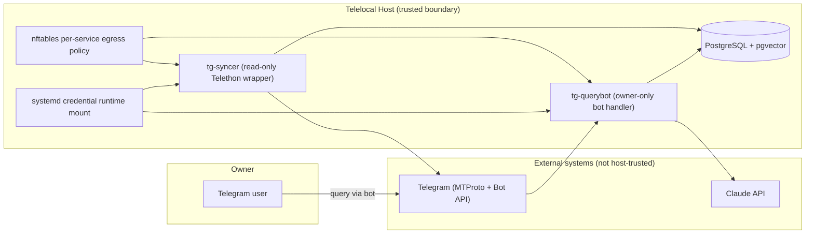
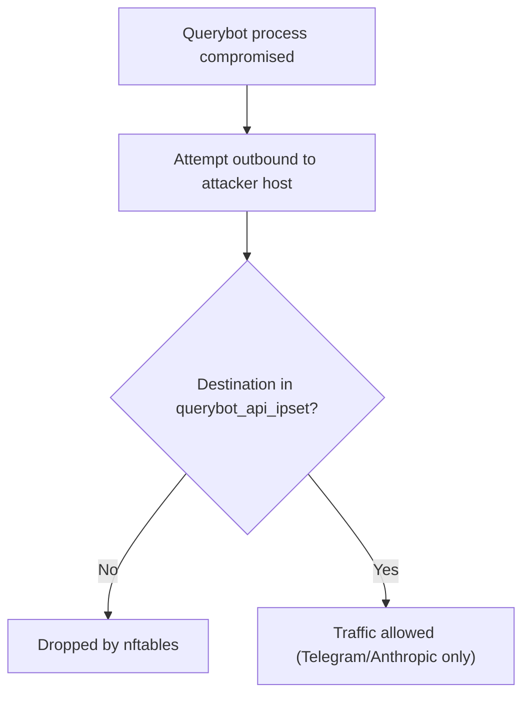
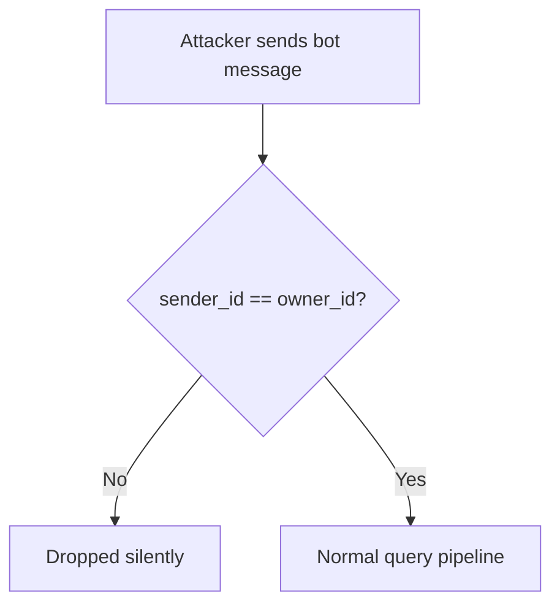
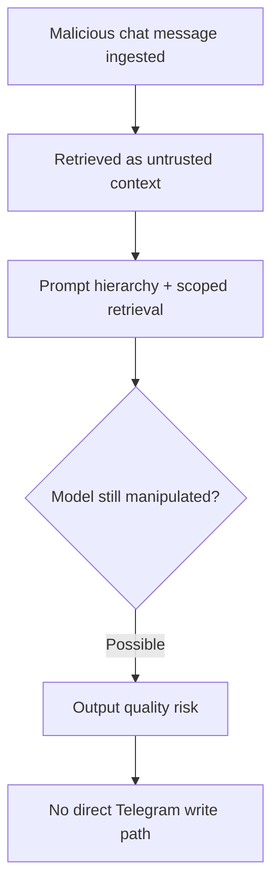

# Security Model

This is the authoritative security reference for Telelocal.

It describes:

- what assets matter,
- which controls exist in code/runtime,
- how those controls interact,
- where risk still remains.

Related docs:

- `TELETHON_HARDENING.md` (Telethon-specific controls)
- `QUICKSTART.md` (deployment + operational checks)
- `../../README.md` (project overview)

Use this doc by goal:

- quick risk posture: sections 1, 5, 6, 11
- operational checks: sections 9 and 10
- control details and assumptions: appendices

## Table of Contents

- [1. Executive Summary](#1-executive-summary)
- [2. Scope And Security Goals](#2-scope-and-security-goals)
- [3. System Context And Trust Boundaries](#3-system-context-and-trust-boundaries)
- [4. Assets And Threat Actors](#4-assets-and-threat-actors)
- [5. Defense-In-Depth Controls](#5-defense-in-depth-controls)
- [6. Compromise Blast Radius](#6-compromise-blast-radius)
- [7. Threat Catalog (STRIDE-Aligned)](#7-threat-catalog-stride-aligned)
- [8. Attack Path Walkthroughs](#8-attack-path-walkthroughs)
- [9. Security Verification And Monitoring](#9-security-verification-and-monitoring)
- [10. Incident Response](#10-incident-response)
- [11. Accepted Risks](#11-accepted-risks)
- [12. Assumptions And Review Cadence](#12-assumptions-and-review-cadence)
- [Appendix A: Service Capability Matrix](#appendix-a-service-capability-matrix)
- [Appendix B: Current Hardening Directive Reference](#appendix-b-current-hardening-directive-reference)
- [Appendix C: Full-Disk Encryption (LUKS) Recommendation](#appendix-c-full-disk-encryption-luks-recommendation)

---

## 1. Executive Summary

### Critical fact

A usable Telethon session is equivalent to account-level Telegram access.

If an attacker can operate that session, they can act as the account holder.

### Core design decision

Telelocal accepts MTProto session risk to gain broad chat coverage, then reduces exposure with layered controls:

1. process isolation,
2. strict credential handling,
3. kernel-level network egress restrictions,
4. read-only application boundaries,
5. least-privilege DB access,
6. auditability.

### What this model does well

- Strongly reduces accidental and low/medium-sophistication misuse.
- Constrains blast radius for single-service compromise.
- Makes verification and incident response operationally tractable.

### What this model cannot guarantee

- Full host/root compromise remains high impact.
- Kernel-level escape defeats user-space isolation.
- LLM prompt injection cannot be completely eliminated.

---

## 2. Scope And Security Goals

### In scope

- `tg-syncer`, `tg-querybot`, PostgreSQL role model
- systemd service hardening
- nftables policy for service users
- credential loading and storage model
- message ingestion/query data flow boundaries
- audit logging and verification

### Out of scope

- Telegram platform internals
- Anthropic internal controls
- Supply-chain attestation beyond pinned dependency strategy
- Hardware side-channel resistance beyond practical host hardening

### Security goals

1. Prevent unintended Telegram write actions from syncer path.
2. Prevent broad credential leakage via files/config/runtime shortcuts.
3. Reduce exfiltration options from compromised service processes.
4. Enforce owner-only query interface behavior.
5. Preserve forensic trail for security investigations.

---

## 3. System Context And Trust Boundaries



Trust interpretation:

- Trusted: local host controls + database.
- Semi-trusted: Telegram transport/content source.
- Untrusted for control purposes: external message content and internet-facing dependencies.

---

## 4. Assets And Threat Actors

### High-value assets

| Asset | Why it matters | Typical location |
|---|---|---|
| Telethon session (encrypted) | Account-level Telegram access if misused | `/var/lib/tg-syncer/tg_syncer_session.session.enc` |
| Session encryption key | Decrypts Telethon session blob | `LoadCredentialEncrypted` runtime from `/etc/credstore.encrypted/` |
| Bot token | Bot impersonation/control | `LoadCredentialEncrypted` runtime |
| Claude API key | Billing + cloud API usage | `LoadCredentialEncrypted` runtime |
| Message corpus | Sensitive history + relationship metadata | PostgreSQL `messages` |
| Audit logs | Incident forensics and behavior traceability | `/var/log/tg-assistant/audit.log` + DB `audit_log` |

### Main threat actors

| Actor | Capability | Typical objective |
|---|---|---|
| Opportunistic internet attacker | Low-medium | RCE, credential theft, generic abuse |
| Targeted attacker | Medium-high | Message/corpus exfiltration, account takeover |
| Malicious chat participant | Low-medium | Prompt injection, output manipulation |
| Compromised dependency | High (in-process) | Arbitrary code under service identity |
| Physical thief | Medium-high | Disk extraction, offline credential recovery |

---

## 5. Defense-In-Depth Controls

### 5.1 Service Isolation And Host Hardening

Each core service runs as a dedicated unprivileged system user:

- `tg-syncer`
- `tg-querybot`

Current hardening baseline in service units includes:

- `NoNewPrivileges=true`
- `ProtectSystem=strict`
- `ProtectHome=true`
- `PrivateTmp=true`
- `PrivateDevices=true`
- `ProtectKernelTunables=true`
- `ProtectKernelModules=true`
- `ProtectKernelLogs=true`
- `ProtectControlGroups=true`
- `RestrictAddressFamilies=AF_INET AF_INET6 AF_UNIX`
- `CapabilityBoundingSet=` (empty)
- `AmbientCapabilities=` (empty)
- `ProtectProc=invisible`
- `ProcSubset=pid`
- `RestrictNamespaces=true`

Compatibility note:

- `MemoryDenyWriteExecute=false` currently (Python 3.13 compatibility tradeoff).
- `SystemCallFilter` is not enabled currently (compatibility tradeoff).
- `SystemCallArchitectures=native` remains enabled.

Security implication:

- Hardening is strong but not maximal seccomp/W^X hardening in current runtime profile.

---

### 5.2 Network Egress Controls (nftables)

Rules are enforced at kernel netfilter layer and scoped by service user identity (`meta skuid`), in table:

- `inet tg_assistant_isolation`

Policy highlights:

- `tg-syncer`:
  - DNS only to resolver IP sets.
  - MTProto egress only to Telegram ranges on `tcp/443`.
  - everything else dropped/logged.
- `tg-querybot`:
  - DNS only to resolver IP sets.
  - HTTPS egress only to dynamic IP sets for:
    - `api.telegram.org`
    - `api.anthropic.com`
  - everything else dropped/logged.

Dynamic set refresh:

- script: `scripts/refresh-api-ipsets.sh`
- timer/service: `tg-refresh-api-ipsets.timer` + `tg-refresh-api-ipsets.service`
- assumption: resolver responses used for set refresh are trustworthy.

Important caveat:

- if a configured DNS resolver is compromised, querybot API IP allowlists could be widened to attacker-controlled destinations until corrected.

Security objective:

- make exfiltration and C2 materially harder even after app-level compromise.

---

### 5.3 Credential Security Model

### Storage and injection path

1. Credentials encrypted at rest under `/etc/credstore.encrypted/`.
2. Services load them via `LoadCredentialEncrypted=...`.
3. Decrypted values appear in service-private runtime credentials directory (`$CREDENTIALS_DIRECTORY`).
4. Application reads through `shared.secrets.get_secret()`.

Primary runtime lookup order in `shared.secrets`:

1. `$CREDENTIALS_DIRECTORY/<key_name>` (production path)
2. `secret-tool` keychain lookup (fallback)
3. env-var fallback only when `TG_ASSISTANT_ALLOW_ENV_SECRETS=1` (development only)

Production recommendation:

- keep environment fallback disabled (default),
- rely on `LoadCredentialEncrypted` path only.

### Credential separation

- Syncer receives:
  - `session_encryption_key`
  - `tg-assistant-api-id`
  - `tg-assistant-api-hash`
- Querybot receives:
  - `tg-assistant-bot-token`
  - `tg-assistant-claude-api-key`

No shared plaintext credential files in config.

---

### 5.4 Application-Layer Controls

### Read-only Telegram wrapper (syncer)

`ReadOnlyTelegramClient` enforces explicit allowlist with default deny.

Allowed methods:

- `get_messages`
- `iter_messages`
- `get_dialogs`
- `iter_dialogs`
- `get_entity`
- `get_participants`
- `get_me`
- `download_profile_photo`
- `connect`
- `disconnect`
- `is_connected`

Security property:

- write-capable Telethon calls are blocked unless wrapper is bypassed via in-process code execution.

### Owner-only bot behavior (querybot)

Two layers:

1. registration-time filter (`filters.User(owner_id)`),
2. handler-level `@owner_only` guard.

Behavior:

- non-owner messages are silently dropped.

### Untrusted content treatment

- synced message content is treated as untrusted in prompt design,
- retrieval is scoped before synthesis,
- no write path from LLM output to Telegram account actions.

---

### 5.5 Database Security Controls

DB auth model:

- Unix socket peer-auth mapping system users to DB roles.
- No DB passwords in config files.

Role posture (from setup SQL):

- `syncer_role`:
  - `SELECT, INSERT` on `messages`
  - `UPDATE (embedding)` on `messages`
  - `SELECT, INSERT, UPDATE` on `chats`
  - `INSERT` on `audit_log`
- `querybot_role`:
  - `SELECT` on `messages`, `chats`
  - `INSERT` on `audit_log`

Security intent:

- query path cannot mutate corpus,
- ingest path has only required write scope.

---

### 5.6 Auditability

Audit events are written to:

- file: `/var/log/tg-assistant/audit.log` (JSON lines),
- DB table: `audit_log`.

What is logged:

- sync events,
- query events,
- authorization decisions,
- blocked/denied operations,
- success/failure metadata.

Security objective:

- provide post-incident timeline and anomaly visibility.

---

## 6. Compromise Blast Radius

| Compromised component | Likely attacker capability | Explicit constraints still active |
|---|---|---|
| `tg-querybot` process | read query corpus + call allowed external APIs | cannot modify messages via DB role; cannot egress arbitrarily due nftables |
| `tg-syncer` process | read Telegram data path + write ingest path | constrained by egress allowlist and service sandbox; wrapper blocks write methods under non-bypass operation |
| `querybot_role` credentials/session | read corpus tables + insert audit rows | no corpus mutation grants |
| encrypted credstore blobs only | offline possession of encrypted files | not directly useful without host/machine key context |

Important caveat:

- root/kernel compromise can bypass most of the above.

---

## 7. Threat Catalog (STRIDE-Aligned)

| ID | Threat | STRIDE class | Severity | Primary controls |
|---|---|---|---|---|
| T1 | Telethon session theft/use | Spoofing / Elevation | Critical | encrypted session + credential isolation + host hardening |
| T2 | Unintended Telegram writes from sync path | Tampering | Critical | read-only allowlist wrapper |
| T3 | Data exfiltration from compromised service | Information disclosure | High | nftables per-service egress restrictions |
| T4 | Unauthorized bot access | Spoofing | High | owner-only filter + decorator |
| T5 | Cross-service credential abuse | Elevation | High | per-service credential injection + dedicated users |
| T6 | Query corpus theft via DB role misuse | Information disclosure | High | role separation + local DB boundary |
| T7 | Prompt injection and reasoning manipulation | Tampering | Medium | untrusted-context prompting + scoped retrieval + no write path |
| T8 | Supply-chain compromise in Python dependency | Elevation | Medium-High | pinned deps + sandbox + egress controls |
| T9 | Audit suppression/tampering | Repudiation | Medium | dual sinks + restricted role permissions |
| T10 | Telegram policy/rate-limit disruption | Availability | Medium | conservative sync pacing + retry/backoff |

Residual-risk realities:

- T1, T7, T8 remain core non-zero risks by architecture.

---

## 8. Attack Path Walkthroughs

### 8.1 Path A: Exfiltration attempt from compromised querybot



Expected outcome:

- arbitrary destination exfiltration blocked at kernel layer.

### 8.2 Path B: Non-owner bot probing



Expected outcome:

- probing accounts receive no response body and minimal signal.

### 8.3 Path C: Malicious prompt payload in synced message



Expected outcome:

- manipulation risk reduced, not eliminated;
- blast radius limited to answer quality.

---

## 9. Security Verification And Monitoring

### 9.1 Baseline checks (post-deploy and after updates)

```bash
telelocal status
telelocal sync-status
sudo ./tests/security-verification.sh
```

### 9.2 Ongoing checks

```bash
# runtime logs
telelocal logs

# audit tail
tail -n 200 /var/log/tg-assistant/audit.log

# API IP set refresh health
journalctl -u tg-refresh-api-ipsets.service -n 50 --no-pager

# nftables table inspection
sudo nft list table inet tg_assistant_isolation
```

### 9.3 High-signal indicators

| Signal | Why it matters |
|---|---|
| repeated blocked outbound logs for service users | possible compromise or misconfiguration |
| repeated owner-only blocks | targeted probing of bot endpoint |
| ingest volume collapse without config change | auth/session/rate-limit or runtime failure |
| sudden query volume spike | automation abuse or token compromise |

---

## 10. Incident Response

If compromise is suspected:

1. Stop services:
   - `sudo systemctl stop tg-syncer tg-querybot`
2. Preserve evidence:
   - copy `/var/log/tg-assistant/audit.log`
   - export relevant journal logs
3. Revoke/rotate:
   - Telethon session (Telegram device list)
   - Telegram API ID/hash
   - bot token
   - Claude API key
   - session encryption key
4. Re-run security verification:
   - `sudo ./tests/security-verification.sh`
5. Recreate session and restart only after review.

Critical reminder:

- if session compromise is plausible, treat it as account compromise until revoked.

---

## 11. Accepted Risks

| Risk | Why accepted | Operator expectation |
|---|---|---|
| in-memory credential/session exposure under root compromise | unavoidable for active runtime | prioritize host hardening and patch cadence |
| prompt injection residual risk | no deterministic perfect filter exists | treat responses as advisory, especially for high-stakes decisions |
| cloud context exposure to LLM provider | required for current answer quality | avoid querying highly regulated/ultra-sensitive content |
| supply-chain compromise potential | Python ecosystem reality | keep dependency updates controlled and reviewed |
| DNS-based API allowlist refresh trust | dynamic IP sets depend on resolver integrity | use trusted resolvers and investigate unexpected refresh diffs/logs |

---

## 12. Assumptions And Review Cadence

Key assumptions:

1. host OS and kernel receive security updates,
2. service units and nftables rules remain intact after updates,
3. physical host access is controlled,
4. owner account and bot token operational ownership remains centralized,
5. operators review audit and service health on a recurring basis,
6. configured DNS resolvers are trusted to return correct API host records.

Recommended review cadence:

- weekly:
  - `telelocal status`, `telelocal sync-status`, audit/log review.
- after each deploy/update:
  - `sudo ./tests/security-verification.sh`.
- quarterly:
  - rotate API keys, review threat model assumptions and firewall policy.

---

## Appendix A: Service Capability Matrix

### `tg-syncer` can

- read dialogs/messages through read-only wrapper,
- insert messages/chats and update `embedding` column,
- insert audit events,
- access only its credential set.

### `tg-syncer` cannot (by intended design)

- call non-allowlisted Telethon methods,
- access querybot secrets,
- egress to arbitrary internet destinations.

### `tg-querybot` can

- read corpus (`messages`, `chats`),
- insert audit events,
- call Telegram Bot API + Anthropic API (allowlisted sets),
- respond only to owner account.

### `tg-querybot` cannot

- mutate message corpus via DB permissions,
- access syncer session/encryption credentials,
- egress to arbitrary hosts under enforced nftables policy.

---

## Appendix B: Current Hardening Directive Reference

Source of truth:

- `systemd/tg-syncer.service`
- `systemd/tg-querybot.service`

Key directives currently active:

```ini
NoNewPrivileges=true
ProtectSystem=strict
ProtectHome=true
PrivateTmp=true
PrivateDevices=true
ProtectKernelTunables=true
ProtectKernelModules=true
ProtectKernelLogs=true
ProtectControlGroups=true
RestrictAddressFamilies=AF_INET AF_INET6 AF_UNIX
CapabilityBoundingSet=
AmbientCapabilities=
ProtectProc=invisible
ProcSubset=pid
RestrictNamespaces=true
SystemCallArchitectures=native
MemoryDenyWriteExecute=false
LoadCredentialEncrypted=...
```

Security tradeoff note:

- `SystemCallFilter` and `MemoryDenyWriteExecute=true` are currently not enforced due Python 3.13/runtime compatibility constraints.
- Revisit if runtime stack allows re-enabling without reliability regressions.

---

## Appendix C: Full-Disk Encryption (LUKS) Recommendation

`systemd-creds` protects credential blobs at rest, but host-level offline disk theft risk is reduced further with LUKS.

Use LUKS if:

- host is in shared/semi-public physical environment,
- theft/loss risk is non-trivial,
- legal or policy controls require stronger at-rest guarantees.

Without LUKS:

- encrypted credential blobs still help,
- but full filesystem contents remain physically recoverable with enough access/time.
